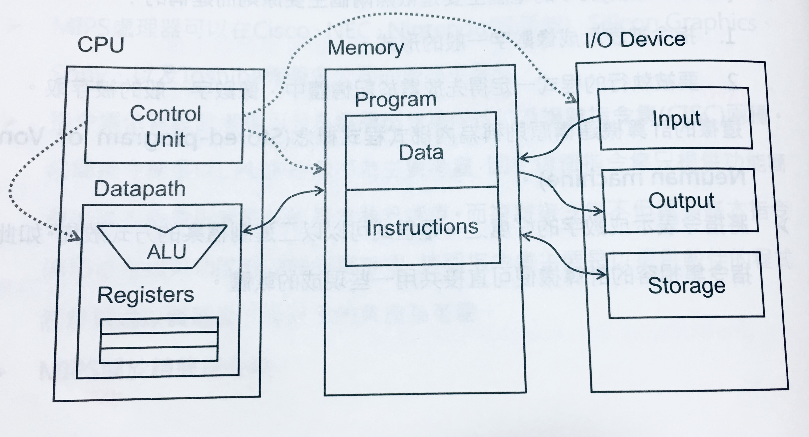
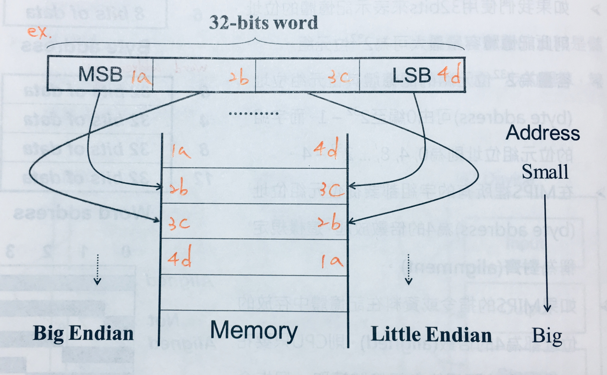
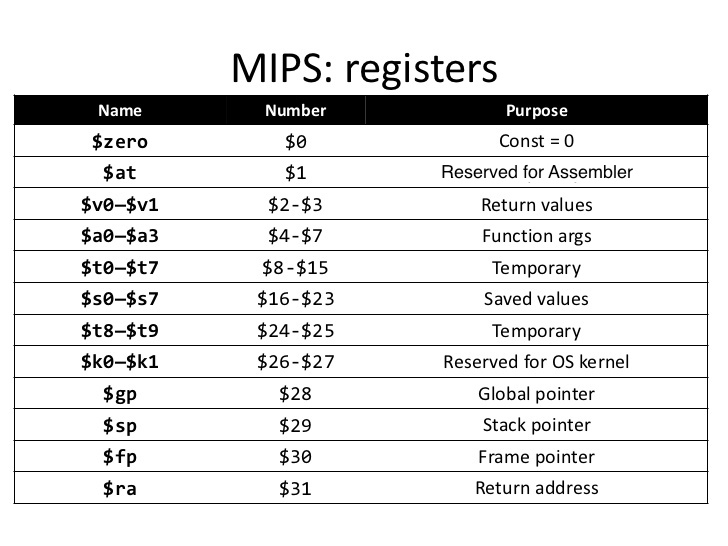
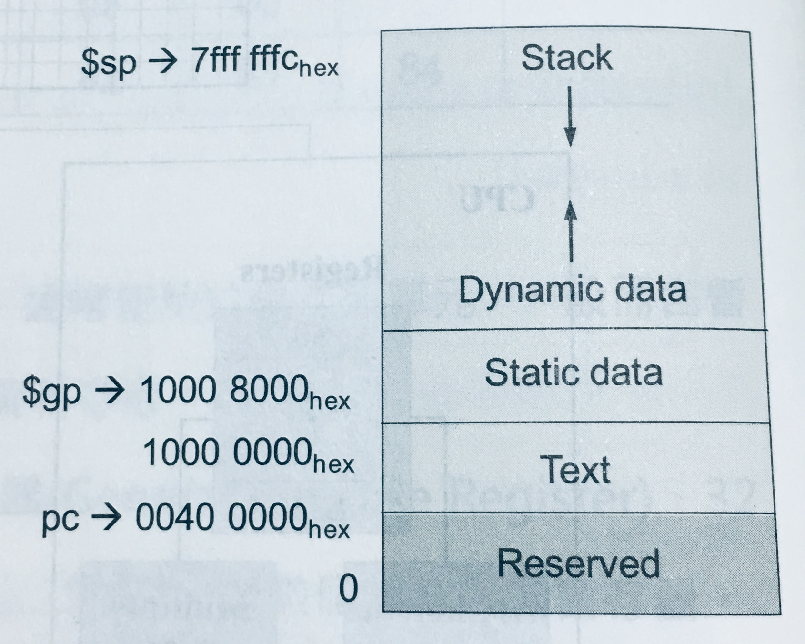
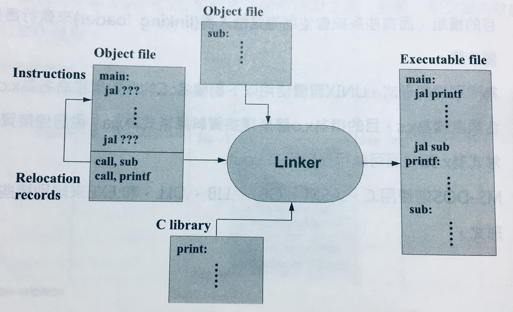
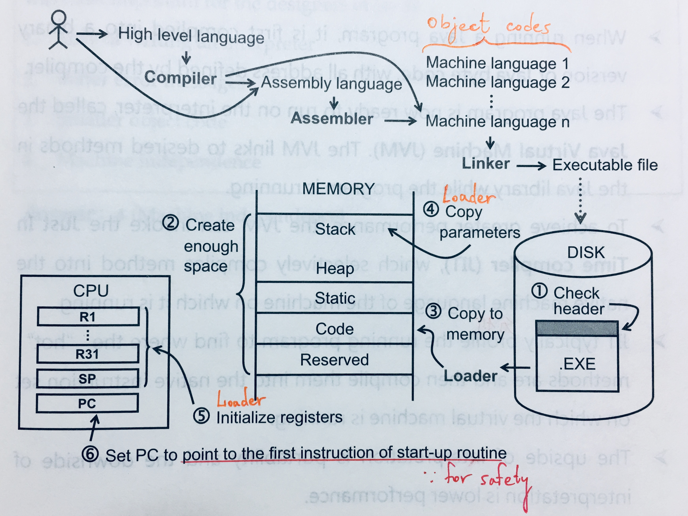

# {{ book.computer_organization.chapter1.title }}
<!-- toc -->

## 基本概念
---
- 計算機組織:「軟體最硬，硬體最軟」
- 計算機的**命令(commands)**:
  - **低階**語言: **指令(instructions)**，為 CPU 可執行的最基本運算
  - **高階**語言: **敘述(statements)**，可由一或多條指令所構成
- **指令集(instruction set)**: 一部計算機所可執行的指令之集合
  - **精簡指令集**(Reduced Instruction Set Computing, **RISC**): **MIPS**, **ARM**, SPARC, DEC Alpha, HP PA-RISC, ...etc.
    - 以**CPU執行效率**為考量
  - **複雜指令集**(Complex Instruction Set Computing, **CISC**): **Intel 80x86**, IBM System/360, DEC VAX, Motorola 68000, ...etc.
    - 提供較強的複雜指令，構成**較佳的程式設計環境**以減輕 programmer 的負擔
    - 兼具基本指令
- **指令集架構(Instruction Set Architecture, ISA)**: 為了學習撰寫低階語言而所必須了解的基本硬體架構及指令集之合稱


Prior to the early 1980's, machines were built with more and more complex instruction set, but why has there been a move to RISC machines away from complex instruction machines?

> 1. Since **early computers** had **limited memory capacities** and were **expensive**, having a **CISC** instruction set enabled performing **complex operations with very few instructions**.
> 2. **Writing a compiler to generate efficient code** easier: **RISC > CISC** architecture.
> 3. **Pipeline** easier: **RISC > CISC** instructions.

## MIPS (Microprocessor without Interlocked Pipe Stages)
---
- 課本使用: MIPS **R2000**
- **字組(word)**: ? bits(字組大小)的CPU一次可以處理的資料量，其一般目的暫存器(General Purpose Registers, GPR)與算術邏輯運算單元(Arithmetic Logic Unit, ALU)亦為 ? bits

## 內儲式程式概念 (Stored-Program Computer or Von Neuman Machine)
---
- 兩個主要建構原則:
  - **指令被表示成像數字一般的形式**，使程式能以二進制檔案的方式散佈，因此相容的指令集所造成的計算機便可共用一些現成的軟體
  - **要被執行的程式一定得先放置於記憶體中，像數字一般的被存取**
  
## 指令集架構: Hardware Information + Instruction Set
---
- 學習低階組合語言時所必須了解的**硬體資訊(Hardware Information)**應包含以下項目:
  - **記憶體(Memory)**
  - **暫存器(Register)**
  - **指令格式(Instruction Format)**
  - **定址模式(Addressing Mode)** 
- 計算機基礎架構(Basic Computer Structure)五個單元:
  - 控制單元(Control Unit)
  - 資料路徑(Datapath): ALU + Registers, 真正處理資料和執行指令之電路
    > **處理器(Processor)**: Control Unit + Datapath
  - 記憶體(Memory)
  - 輸入設備(Input Device)
  - 輸出設備(Output Device)

### 記憶體 (Memory)
- 一個一維的大陣列: 位址(address) => 位元組(byte, 8 bits)
- **byte addressing** (32 bits Memory):

| address            |        |
|:------------------:|:------:|
| 0                  | 8 bits |
| 1                  | 8 bits |
| 2                  | 8 bits |
| ...                | ...    |
| $$ 2 ^ {32} - 1 $$ | 8 bits |

- **word addressing** (32 bits Memory):

| address             |        |        |        |        |
|:-------------------:|:------:|:------:|:------:|:------:|
| 0                   | 8 bits | 8 bits | 8 bits | 8 bits |
| 4                   | 8 bits | 8 bits | 8 bits | 8 bits |
| 8                   | 8 bits | 8 bits | 8 bits | 8 bits |
| ...                 | ...    | ...    | ...    | ...    |
| $$ 2 ^ {32}  - 4 $$ | 8 bits | 8 bits | 8 bits | 8 bits |

- **對齊(alignment)**: MIPS 裡所有字組都要從**位元組位址(byte address)為4的倍數**放起，如此一來 CPU 只要花一次存取時間便能自記憶體讀取一個指令或一個字組資料

#### 位元順序 (Byte-Order or Endianness)
- **Big Endian**:
  - 32-bits word 中**最左邊**或**最大位元組(Most Significand Byte, MSB)**被放置於**最低記憶體位置**
  - **MIPS**, IBM System/360, Motorola 68000, SPARC, HP PA-RISC, ...etc.
- **Little Endian**:
  - 32-bits word 中**最右邊**或**最小位元組(Least Significand Byte, LSB)**被放置於**最低記憶體位置**
  - **Intel 80x86**, **ARM**, DEC VAX, DEC Alpha, ...etc.

### 暫存器 (Register)
- CPU 裡儲存運算元的記憶元件，量少而資料存取快速
- MIPS 共有:
  - 特殊目的暫存器(Special Purpose Register, **SPR**) x **3**
    - **$Hi** & **$Lo**: **64-bits**暫存器，存放**乘法**運算的乘積**高($Hi)低($Lo)位元**和**除法**運算的**餘($Hi)和商($Lo)**
    - **$PC(程式計數器, Program Counter)**: **32-bits**暫存器，存放**下一個要被執行的指令所在的記憶體位址**
  - **32-bits**浮點數運算暫存器(Floating Point Register, **FPR**): **$f0 - $f32** x **32**
    - 存在 **Coprocessor1** 裡，又稱浮點運算器(Floaing Point Unit, **FPU**)
  - **32-bits**一般目的暫存器(General Purpose Register, **GPR**) x **32**


**注意**: 若下方表格在手機、平板裝置或電腦螢幕上跑版，可參照表格下方圖片


| type              | name      | number    | usage                   |
|:----------------- |:--------- |:--------- |:----------------------- |
| Assember related  | $at       | $1        | Preserved for Assembler |
| OS related        | $ko - $k1 | $26 - $27 | Preserved for OS        |
| \*Procedure call  | $vo - $v1 $a0 - $a3 $ra | $2 - $3 $4 - $7 $31 | Values for results Function arguments Return address |
| Memory management | $gp $sp $fp | $28 $29 $30 | Global pointer Stack pointer Frame pointer |
| Variables/ Temporaries/ Zero | $s0 - $s7 $t0 - $t7 $t8 - $t9 $zero | $16 - $23 $8 - $15 $24 - $25 $0 | \*Saved \*Temporaries \*More Temporaries \*Constant of Zero |
> - Procedure call: 副程式呼叫相關
> - Saved: 分配給常用變數, store to Memory if spilled.
> - Temporaries & More Temporaries: 存放運算過程中之結果
> - Constant of Zero: Read only.

- **溢出暫存器(splling register)**: 將不常用的變數從暫存器放入記憶體
  - $$ \because $$ 程式裡使用的變數 > 暫存器數量 $$ \therefore $$ compiler 將常用變數存暫存器，其餘放記憶體，並 I/O by load & store 指令


存取速度: 暫存器 > 記憶體，為何不多設計一些暫存器來存取變數?

> CPU 存取暫存器時需經解碼程序以指定所要的暫存器: 暫存器 $$ \uparrow $$  
> $$ \Rightarrow $$ 解碼時間 $$ \uparrow $$ $$ \Rightarrow $$ CPU的時脈週期(clock cycle time) $$ \uparrow $$ $$ \Rightarrow $$ CPU 執行效率 $$ \downarrow $$ $$ \Rightarrow $$ CPU 功率消耗 $$ \uparrow $$

### 記憶體管理及相關暫存器

- Stack: 放區域變數，$$ \downarrow $$
  - 啟動紀錄(Activation Record): 又稱程序框(Procedure Frame)
  - **$fp(frame pointer)**: 指向 Activation Record 第一個字組的暫存器
  - **$sp(stack pointer)**: 指向 Stack 最新資料所在位址的暫存器

- Dynamic Data(Heap): 放動態指標變數，$$ \uparrow $$
- Static Data: 放全域變數
  - **$gp(global pointer)**: 指向 Static Data 的暫存器
- Text: 放程式碼
- Reserved: for I/O Devices.

## 程式之轉譯與執行
---
### 高階語言步驟
1. 高階語言(C) $$ \rightarrow $$ **compiler 編譯** $$ \rightarrow $$ 組合語言(Assembly)
> 組合語言: `.a`(UNIX)/`.ASM`(MS-DOS)
2. 組合語言 $$ \rightarrow $$ **assembler 組譯** $$ \rightarrow $$ 機器語言的目的模組(Object: Machine language module)
> 機器語言的目的模組: `.o`(UNIX)/`.OBJ`(MS-DOS)
3. 機器語言的目的模組 + 資料庫常式(Object: Library routine in Machine language) $$ \rightarrow $$ **linker 連結** $$ \rightarrow $$ 可執行檔(Executable: Machine language)
> 靜態, 動態連接資料庫常式: `.s`, `.so`(UNIX)/`.LIB`, `.DLL`(MS-DOS)  
> 可執行檔: `a.out`(default in UNIX)/`.EXE`(MS-DOS)
4. 可執行檔 $$ \rightarrow $$ **loader 載入** $$ \rightarrow $$ 記憶體

> 現代加速轉譯過程:
> - 有些 compiler $$ \because $$ 自帶 assembler, 而能從高階語言直接產生機器語言的目的模組
> - 有些系統會使用連結載入器(linking loader)直接完成最後兩步驟

### 組譯器 (Assembler)
組譯過後，機器語言的目的模組包含以下資訊:
- 標頭(header): 目的模組的內容, 大小, 位置...etc.
- 指令區(text segment): 指令的機器語言碼
- 資料區(data segment): 程式生命週期內的所有靜態與動態資料
- relocation information: 當程式載入記憶體時，指令與資料之相對位置
- symbol table: 儲存未定義的標籤，如外部參考資料
- debug information: 用來連結原始程式碼

### 連結器 (Linker) 的三個執行步驟
1. 將目的模組的指令與資料**象徵性的(symbolically)**放置於記憶體中
> 象徵性的放置: 非實際放入
2. 決定資料與指令標籤(instruction label)的位址
3. 決定內外部位址參考

### 載入器 (Loader) 的六個執行步驟
1. 讀取可執行檔的標頭，決定指令區及資料區大小
2. 產生一個足夠容納可執行檔的所有指令及資料之記憶體空間
3. 複製可執行檔的指令及資料至記憶體
4. 複製主程式的參數至堆疊
5. 初始化暫存器，並將 $sp 設定在 Stack 的第一個可用的空間
6. 跳至**啟動常式(start-up routine)**: 此程式會呼叫要被執行的主程式。當主程式結束時，會使用 exit 系統呼叫來終結程式的執行

### Java 的轉譯步驟
1. Java $$ \rightarrow $$ **compiler 編譯** $$ \rightarrow $$ Java bytes code
> Java bytes code: `.class`
2. Java bytes code $$ \rightarrow $$ **interpreter(Java Virtual Machine, JVM) 直譯** $$ \rightarrow $$ 虛擬機的機器語言(Machine language on virtual machine)
> - JVM invoke **JIT(Just In Time) compiler**, which **profile** the running program and **selectively compile "hot" methods** into the native instruction set on which the virtual machine.
> - Interpretation **優點: portable, machine independent** $$ \leftrightarrow $$ **缺點: lower performance**
