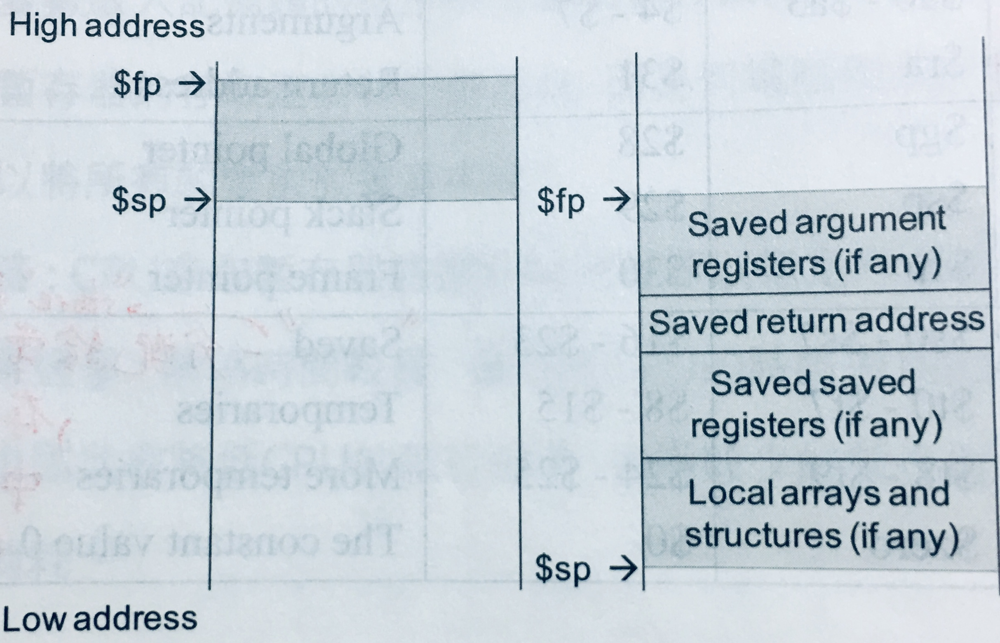

# {{ book.computer_organization.chapter1.title }}
<!-- toc -->

## 基本概念
- 計算機的**命令(commands)**:
  - **低階**語言: **指令(instructions)**，為 CPU 可執行的最基本運算
  - **高階**語言: **敘述(statements)**，可由一或多條指令所構成
- **指令集(instruction set)**: 一部計算機所可執行的指令之集合
  - **精簡指令集**(Reduced Instruction Set Computing, **RISC**): **MIPS**, **ARM**, SPARC, DEC Alpha, HP PA-RISC, ...etc.
    - 以**CPU執行效率**為考量
  - **複雜指令集**(Complex Instruction Set Computing, **CISC**): **Intel 80x86**, IBM System/360, DEC VAX, Motorola 68000, ...etc.
    - 提供較強的複雜指令，構成**較佳的程式設計環境**以減輕 programmer 的負擔
    - 兼具基本指令
- **[指令集架構(Instruction Set Architecture, ISA)](#instruction-set-architecture)**: 為了學習撰寫低階語言而所必須了解的基本**硬體架構**及**指令集**之合稱


Prior to the early 1980's, machines were built with more and more complex instruction set, but why has there been a move to RISC machines away from complex instruction machines?

> 1. Since **early computers** had **limited memory capacities** and were **expensive**, having a **CISC** instruction set enabled performing **complex operations with very few instructions**.
> 2. **Writing a compiler to generate efficient code** easier: **RISC > CISC** architecture.
> 3. **Pipeline** easier: **RISC > CISC** instructions.

## MIPS (Microprocessor without Interlocked Pipe Stages)
- 課本使用: MIPS **R2000**
- **字組(word)**: ? bits(字組大小)的CPU一次可以處理的資料量，其一般目的暫存器(General Purpose Registers, GPR)與算術邏輯運算單元(Arithmetic Logic Unit, ALU)亦為 ? bits

## 內儲式程式概念 (Stored-Program Computer or Von Neuman Machine)
- 兩個主要建構原則:
  - **指令被表示成像數字一般的形式**，使程式能以二進制檔案的方式散佈，因此相容的指令集所造成的計算機便可共用一些現成的軟體
  - **要被執行的程式一定得先放置於記憶體中，像數字一般的被存取**
  
## 指令集架構 (Instruction Set Architecture) {#instruction-set-architecture}
$$ \rightarrow \Large{\text{Hardware Information}} $$ + $$ \Large{\text{Instruction Set}} $$
- 學習低階組合語言時所必須了解的**硬體資訊(Hardware Information)**應包含以下項目:
  - **[記憶體(Memory)](#memory)**
  - **[暫存器(Register)](#register)**
  - **[指令格式(Instruction Format)](#mips-instruction-format)**
  - **[定址模式(Addressing Mode)](#mips-addressing-mode)** 
- 計算機基礎架構(Basic Computer Structure)五個單元:
  - 控制單元(Control Unit)
  - 資料路徑(Datapath): ALU + Registers, 真正處理資料和執行指令之電路
    > **處理器(Processor)**: Control Unit + Datapath
  - 記憶體(Memory)
  - 輸入設備(Input Device)
  - 輸出設備(Output Device)


### 記憶體 (Memory) {#memory}
- 一個一維的大陣列: 位址(address) => 位元組(byte, 8 bits)
- **byte addressing** (32 bits Memory):

| address            |        |
|:------------------:|:------:|
| 0                  | 8 bits |
| 1                  | 8 bits |
| 2                  | 8 bits |
| ...                | ...    |
| $$ 2 ^ {32} - 1 $$ | 8 bits |

- **word addressing** (32 bits Memory):

| address             |        |        |        |        |
|:-------------------:|:------:|:------:|:------:|:------:|
| 0                   | 8 bits | 8 bits | 8 bits | 8 bits |
| 4                   | 8 bits | 8 bits | 8 bits | 8 bits |
| 8                   | 8 bits | 8 bits | 8 bits | 8 bits |
| ...                 | ...    | ...    | ...    | ...    |
| $$ 2 ^ {32}  - 4 $$ | 8 bits | 8 bits | 8 bits | 8 bits |

- **對齊(alignment)**: MIPS 裡所有字組都要從**位元組位址(byte address)為4的倍數**放起，如此一來 CPU 只要花一次存取時間便能自記憶體讀取一個指令或一個字組資料

#### 位元順序 (Byte-Order or Endianness)
- **Big Endian**:
  - 32-bits word 中**最左邊**或**最大位元組(Most Significand Byte, MSB)**被放置於**最低記憶體位置**
  - **MIPS**, IBM System/360, Motorola 68000, SPARC, HP PA-RISC, ...etc.
- **Little Endian**:
  - 32-bits word 中**最右邊**或**最小位元組(Least Significand Byte, LSB)**被放置於**最低記憶體位置**
  - **Intel 80x86**, **ARM**, DEC VAX, DEC Alpha, ...etc.


### 暫存器 (Register) {#register}
- CPU 裡儲存運算元的記憶元件，量少而資料存取快速
- MIPS 共有:
  - 特殊目的暫存器(Special Purpose Register, **SPR**) $$ \times $$ **3**
    - **$Hi** & **$Lo**: **64-bits**暫存器，存放**乘法**運算的乘積**高($Hi)低($Lo)位元**和**除法**運算的**餘($Hi)和商($Lo)**
    - **$PC(程式計數器, Program Counter)**: **32-bits**暫存器，存放**下一個要被執行的指令所在的記憶體位址**
  - **32-bits**浮點數運算暫存器(Floating Point Register, **FPR**): **$f0 - $f32** $$ \times $$ **32**
    - 存在 **Coprocessor1** 裡，又稱浮點運算器(Floaing Point Unit, **FPU**)
  - **32-bits**一般目的暫存器(General Purpose Register, **GPR**) $$ \times $$ **32**


**注意**: 若下方表格在手機、平板裝置或電腦螢幕上跑版，可參照表格下方圖片


| type              | name      | number    | usage                   |
|:----------------- |:--------- |:--------- |:----------------------- |
| Assember related  | $at       | $1        | Preserved for Assembler |
| OS related        | $ko - $k1 | $26 - $27 | Preserved for OS        |
| \*Procedure call  | $vo - $v1<br>$a0 - $a3<br>$ra | $2 - $3<br>$4 - $7<br>$31 | Values for results<br>Function arguments<br>Return address |
| Memory management | $gp<br>$sp<br>$fp | $28<br>$29<br>$30 | Global pointer<br>Stack pointer<br>Frame pointer |
| Variables/<br>Temporaries/<br>Zero | $s0 - $s7<br>$t0 - $t7<br>$t8 - $t9<br>$zero | $16 - $23<br>$8 - $15<br>$24 - $25<br>$0 | \*Saved<br>\*Temporaries<br>\*More Temporaries<br>\*Constant of Zero |
> - \*Procedure call: 副程式呼叫相關
> - \*Saved: 分配給常用變數, store to Memory if spilled.
> - \*Temporaries & \*More Temporaries: 存放運算過程中之結果
> - \*Constant of Zero: Read only.

#### Registers Table {#registers-table}


- **溢出暫存器(splling register)**: 將不常用的變數從暫存器放入記憶體
> $$ \because $$ 程式裡使用的變數 > 暫存器數量 $$ \therefore $$ compiler 將常用變數存暫存器，其餘放記憶體，並 I/O by load & store 指令


存取速度: 暫存器 > 記憶體，為何不多設計一些暫存器來存取變數?

> CPU 存取暫存器時需經解碼程序以指定所要的暫存器: 暫存器 $$ \uparrow $$  
> $$ \Rightarrow $$ 解碼時間 $$ \uparrow $$ $$ \Rightarrow $$ CPU的時脈週期(clock cycle time) $$ \uparrow $$ $$ \Rightarrow $$ CPU 執行效率 $$ \downarrow $$ $$ \Rightarrow $$ CPU 功率消耗 $$ \uparrow $$

### 記憶體管理及相關暫存器


- Stack: 放區域變數，$$ \downarrow $$
  - 啟動紀錄(Activation Record): 又稱程序框(Procedure Frame)
  - **$fp(frame pointer)**: 指向 Activation Record 第一個字組的暫存器
  - **$sp(stack pointer)**: 指向 Stack 最新資料所在位址的暫存器



- Dynamic Data(Heap): 放動態指標變數，$$ \uparrow $$
- Static Data: 放全域變數
  - **$gp(global pointer)**: 指向 Static Data 的暫存器
- Text: 放程式碼
- Reserved: for I/O Devices.

## 程式之轉譯與執行
### 高階語言步驟
1. 高階語言(C) $$ \rightarrow $$ **compiler 編譯** $$ \rightarrow $$ 組合語言(Assembly)
> 組合語言: `.a`(UNIX)/`.ASM`(MS-DOS)
2. 組合語言 $$ \rightarrow $$ **[assembler 組譯](#assembler)** $$ \rightarrow $$ 機器語言的目的模組(Object: Machine language module)
> 機器語言的目的模組: `.o`(UNIX)/`.OBJ`(MS-DOS)
3. 機器語言的目的模組 + 資料庫常式(Object: Library routine in Machine language) $$ \rightarrow $$ **[linker 連結](#linker)** $$ \rightarrow $$ 可執行檔(Executable: Machine language)
> 靜態, 動態連接資料庫常式: `.s`, `.so`(UNIX)/`.LIB`, `.DLL`(MS-DOS)  
> 可執行檔: `a.out`(default in UNIX)/`.EXE`(MS-DOS)
4. 可執行檔 $$ \rightarrow $$ **[loader 載入](#loader)** $$ \rightarrow $$ 記憶體

> 現代加速轉譯過程:
> - 有些 compiler $$ \because $$ 自帶 assembler, 而能從高階語言直接產生機器語言的目的模組
> - 有些系統會使用連結載入器(linking loader)直接完成最後兩步驟

### 組譯器 (Assembler) {#assembler}
組譯過後，**機器語言的目的模組**包含以下資訊:
- 標頭(header): 目的模組的內容, 大小, 位置...etc.
- 指令區(text segment): 指令的機器語言碼
- 資料區(data segment): 程式生命週期內的所有靜態與動態資料
- relocation information: 當程式載入記憶體時，指令與資料之相對位置
- symbol table: 儲存未定義的標籤，如外部參考資料
- debug information: 用來連結原始程式碼

### 連結器 (Linker) 的三個執行步驟 {#linker}
1. 將目的模組的指令與資料**象徵性的(symbolically)**放置於記憶體中
> 象徵性的放置: 非實際放入
2. 決定資料與指令標籤(instruction label)的位址
3. 決定內外部位址參考


### 載入器 (Loader) 的六個執行步驟 {#loader}
1. 讀取可執行檔的標頭，決定指令區及資料區大小
2. 產生一個足夠容納可執行檔的所有指令及資料之記憶體空間
3. 複製可執行檔的指令及資料至記憶體
4. 複製主程式的參數至堆疊
5. 初始化暫存器，並將 $sp 設定在 Stack 的第一個可用的空間
6. 跳至**啟動常式(start-up routine)**: 此程式會呼叫要被執行的主程式。當主程式結束時，會使用 exit 系統呼叫來終結程式的執行


### Java 的轉譯步驟
1. Java $$ \rightarrow $$ **compiler 編譯** $$ \rightarrow $$ Java bytes code
> Java bytes code: `.class`
2. Java bytes code $$ \rightarrow $$ **interpreter(Java Virtual Machine, JVM) 直譯** $$ \rightarrow $$ 虛擬機的機器語言(Machine language on virtual machine)
> - JVM invoke **JIT(Just In Time) compiler**, which **profile** the running program and **selectively compile "hot" methods** into the native instruction set on which the virtual machine.
> - Interpretation **優點: portable, machine independent** $$ \leftrightarrow $$ **缺點: lower performance**

## 指令類別
### Data Movement (Data Transfer)
- load: Memory to CPU
> MIPS:
> - **lw**/**lh**/**lhu**/**lb**/**lbu** *register*, *offset*(*base register*): `register = Memory[offset + base register];`
- store: CPU to Memory
> MIPS:
> - 無 **sbu** 指令($$ \because $$ = **sb**)
> - **sw**/**sh**/**sb** *register*, *offset*(*base register*): `Memory[offset + base register] = register;`
- move: Memory to Memory/Register to Register
- input/output: from I/O devices
- push/pop: to/from Stack

#### 「位移量(基底暫存器)」的記憶體位址
在 **load/store** 指令中，記憶體位址採**基底-位移(base-offset)**表示:
> $$ ^{ex.} $$ If `$s0` points to `A[0]`, how to load `A[8]`'s value to `$t0`?  
> ```mipsasm
> lw $t0, 32($s0) # offset: 32 = 8 x 4 bytes
> ```

### Operation of Arithmetic
For integer or floating point:
- add
> MIPS: 
> - **add** *register1*, *register2*, *register3*: `register1 = register2 + register3;`
- sub
> MIPS:
> - **sub** *register1*, *register2*, *register3*: `register1 = register2 - register3;` 
- multiply
- divide

### Operation of Logical
- shift
> MIPS:
> - 無 **sla(shift left arithmetic)** 指令
> - **sll**/**srl**/**sra** *register1*, *register2*, *constant*: `register1 = register2 <</>>// constant`
>   - **sll**/**srl**: empty bits filled with **0**
>   - **sra**: empty bits filled with **leftest signed bit**

- rotate
- not/and/or/set/clear
> MIPS:
> - **and**/**or**/**xor(互斥)** *register1*, *register2*, *register3*: `register1 = register2 &/|/^ register3;`
> - **nor(not or)** *register1*, *register2*, *register3*: `register1 = ~(register2 | register3);`
> - **not**/**clear(set all digits to 0)**: 為**[虛擬指令](#pseudo-instruction)**
> - **swap**: 也是虛擬指令，可被轉譯成
> ```mipsasm
> xor $s0, $s0, $s1   #    xor $s1, $s0, $s1
> xor $s1, $s0, $s1   # or xor $s0, $s0, $s1
> xor $s0, $s0, $s1   #    xor $s1, $s0, $s1
> ```
> > - 第 `1` 行執行後:
> >   - `$s0`: `$s0` $$ \oplus $$ `$s1`
> >   - `$s1`: `$s1`
> > - 第 `2` 行執行後:
> >   - `$s0`: `$s0` $$ \oplus $$ `$s1`
> >   - `$s1`: `$s0` $$ \oplus $$ **`$s1` $$ \oplus $$ `$s1`** $$ \Rightarrow $$ `$s0` $$ \oplus $$ `$zero` $$ \Rightarrow $$ `$s0`
> > - 第 `3` 行執行後:
> >   - `$s0`: **`$s0`** $$ \oplus $$ `$s1` $$ \oplus $$ **`$s0`** $$ \Rightarrow $$ **`$s0` $$ \oplus $$ `$s0`** $$ \oplus $$ `$s1` $$ \Rightarrow $$ `$zero` $$ \oplus $$ `$s1` $$ \Rightarrow $$ `$s1`
> >   - `$s1`: `$s0`

### Flow Control of Intra Program
From **procedure A** to **procedure A**

- unconditional: **jump**
> MIPS:
> - **j** *label*: `$PC = label;`
> - **jal(jump and link)** *label*: `$ra = $PC + 4; $PC = label;`  
> $$ \rightarrow $$ 其中 **j**/**jal** 的 ***label***: 儲存**這條指令所在的記憶體位址**的**參考(reference)**  
> $$ \rightarrow $$ `$ra = $PC + 4;` 請參考**「[程序呼叫](#procedure-call)」**  
> - **jr** *register*: `$PC = register;`

- conditional: **branch**
> MIPS:
> - **beq** *register1*, *register2*, *label*: `if (register1 == register2) $PC = label;`
> - **bne** *register1*, *register2*, *label*: `if (register1 != register2) $PC = label;`  
> $$ \rightarrow $$ 其中 **beq**/**bne** 的 ***label***: 儲存**這條指令所在的記憶體位址**的**參考(reference)**    
> - **blt**/**bgt**/**ble**/**bge**: 為**[虛擬指令](#pseudo-instruction)**
> - **slt(set if less than)**/**sltu** *register1*, *register2*, *register3*: `register1 = (register2 < register3) ? 1 : 0;`

#### 基本區塊 (Basic Block)
一連串**完全沒有任何 jump/branch 目的地和指令**或如果有
- **jump/branch 目的地**(即 **label**): 只能出現在**區塊的第一條指令處**，與
- **jump/branch 指令**: 只能出現在**區塊的最後一條指令處**

的指令，是 compiler 執行「最佳化」的最基本單位  

$$ \rightarrow $$ **最佳化**: 以最精簡的指令(群)完成當前程式所要執行的功能，減少程式碼佔用記憶體空間並加速程式執行
> $$ ^{ex.} $$ 將以下方 **[Loop Statement](#loop-statement)** 和 **[While Loop Statement](#while-loop-statement)** 的 MIPS 指令群說明是否為基本區塊

#### Loop Statement {#loop-statement}
```c
Loop: 
    g = g + A[i];  
    i = i + j;  
    if (i != h) goto Loop;  
```
| A   | g   | h   | i   | j   |  
|:---:|:---:|:---:|:---:|:---:|  
| $s5 | $s1 | $s2 | $s3 | $s4 |  
```mipsasm
Loop: sll $t1, $s3, 2     # $t1 = 4 * i, 算 address offset of A[]
      add $t1, $t1, $s5   # $t1 = memory address of A[i]
      lw  $t0, 0($t1)     # $t0 = value of A[i] from memory
      add $s1, $s1, $t0   # g = g + A[i];
      add $s3, $s3, $s4   # i = i + j;
      bne $s3, $s2, Loop  # if (i != h) goto Loop;
```
> $$ \checkmark $$ 第 `1` 行 `Loop` label 為第 `6` 行 `bne` 指令之 branch 目的地  
> $$ \checkmark $$ 第 `6` 行 `bne $s3, $s2, Loop` 為 branch 指令  
> $$ \therefore $$ 此群 MIPS 指令即為一**基本區塊**

#### While Loop Statement {#while-loop-statement}
```c
while (save[i] == k)
    i = i + j;  
```
| i   | j   | k   | save |
|:---:|:---:|:---:|:----:|
| $s3 | $s4 | $s5 | $s6  |
```mipsasm
Loop: sll $t1, $s3, 2    # $t1 = 4 * i, 算 address offset of save[]
      add $t1, $t1, $s6  # $t1 = memory address of save[i]
      lw  $t0, 0($t1)    # $t0 = value of save[i] from memory
      bne $t0, $s5, Exit # if (save[i] != k) goto Exit;
      add $s3, $s3, $s4  # i = i + j;
      j   Loop           # goto Loop;
Exit:
```
> ** X ** 第 `1` 行 `Loop` label 為**第 `6` 行** `j` 指令之 jump 目的地  
> ** X 第 `7` 行** `Exit` label 為**第 `4` 行** `bne` 指令之 branch 目的地  
> $$ \therefore $$ 此群 MIPS 指令**不為一基本區塊**，可再由 compiler 細切成三個基本區塊並予以最佳化:  
> ```mipsasm
> Loop: sll $t1, $s3, 2    # $t1 = 4 * i, 算 address offset of save[]
>       add $t1, $t1, $s6  # $t1 = memory address of save[i]
>       lw  $t0, 0($t1)    # $t0 = value of save[i] from memory
>       bne $t0, $s5, Exit # if (save[i] != k) goto Exit;
> ```
> $$ \checkmark $$ 第 `1` 行 `Loop` label 為第 `4` 行 `bne` 指令之 branch 目的地  
> $$ \checkmark $$ 第 `4` 行 `bne $t0, $s5, Exit` 為 branch 指令  
> ```mipsasm
>       add $s3, $s3, $s4  # i = i + j;
>       j   Loop           # goto Loop;
> ```
> $$ \checkmark $$ 第 `2` 行 `j   Loop` 為 jump 指令  
> ```mipsasm
> Exit:
> ```
> $$ \checkmark $$ 首行 `Exit` label 為 jump/branch 目的地

### Flow Control of Inter Program
From **procedure A** to **procedure B**

- call/return

### Flow Control of System Call
- trap/return
> MIPS:
> - **syscall**

### 立即指令 (Immediate Instruction) {#immediate-instruction}
其中一個**運算元(operator)**為**常數**的指令
> MIPS: 指令 + `i`
> - **lui(load upper immediate)** *register*, *constant*: `register = constant << pow(2, 16);`
> - **addi** *register1*, *register2*, *constant*: `register1 = register2 + constant;`
> > 16 bits $$ \rightarrow $$ 32 bits: empty bits filled with **leftest signed bit**
> - 無 **subi** 指令
> - **andi**/**ori** *register1*, *register2*, *constant*: `register1 = register2 &/| constant;`
> > 16 bits $$ \rightarrow $$ 32 bits: empty bits filled with **0**
> - **slti**/**sltiu** *register1*, *register2*, *constant*: `register1 = (register2 < constant) ? 1 : 0;`

> > $$ ^{ex.} $$ How to set `$s0` to $$ \text{0000 0000 0011 1101} $$ $$ \text{0000 1001 0000 0000}_2 $$ ?
> > ```mipsasm
> > lui $s0, 61         # $s0 = 0000 0000 0011 1101 0000 0000 0000 0000 now.
> > ori $s0, $s0, 2304  # $s0 = 0000 0000 0011 1101 0000 1001 0000 0000 now.
> > ```
> > - $$ 61_{10} $$ = $$ \text{0000 0000 0011 1101}_2 $$
> > - $$ 2304_{10} $$ = $$ \text{0000 1001 0000 0000}_2 $$

### 虛擬指令 (Pseudo Instruction or Directive Instruction) {#pseudo-instruction}
實際機器不存在，但可透過 **assembler 轉譯**為機器可執行的指令
 
| 虛擬指令 | 轉譯後的 MIPS 指令 |
|:-------:|:----------------:|
| `not $t0, $s0` | `nor $t0, $s0, $zero` + `nor $t0, $s0, $t0` |
| `clear $t0` | `add $t0, $zero, $zero` |
| `blt $s1, $s2, L`($$ < $$) | `slt $t0, $s1, $s2` + `bne $t0, $zero, L` |
| `bgt $s1, $s2, L`($$ > $$) | `slt $t0, $s2, $s1` + `bne $t0, $zero, L` |
| `ble $s1, $s2, L`($$ \ge $$) | `slt $t0, $s2, $s1` + `beq $t0, $zero, L` |
| `bge $s1, $s2, L`($$ \le $$) | `slt $t0, $s1, $s2` + `beq $t0, $zero, L` |
| `move $t1, $t2` | `add $t1, $t2, $zero` |

## 程序呼叫 {#procedure-call}
1. 將引數放在被呼叫程序(Callee)可以存取的地方
> set arguments(`$a0` ~ `$a3`)
2. 將控制權轉移給被呼叫程序
> `jal Callee`
3. 取得被呼叫程序所需的儲存資源，如果呼叫程序(Caller)在被呼叫程序結束後仍需要使用
> save saved registers(`$s0` ~ `$s7`)  
> and temporary registers(`$t0` ~ `$t9`) into Memory

  3.1 取得**引數**與**程序返回位址**，如果被呼叫程序亦為**呼叫本身或其他程序的呼叫程序**
  > save arguments(`$a0` ~ `$a3`) and return address(`$ra`) into Memory
4. 執行被呼叫程序所指定工作
> execute specified jobs

  - 還原**引數**與**程序返回位址**，如果被呼叫程序亦為**呼叫本身或其他程序的呼叫程序**
  > restore arguments(`$a0` ~ `$a3`) and return address(`$ra`) from Memory
5. 將所得結果放在呼叫程序可以存取得到的地方
> set return values(`$v0` ~ `$v1`)

  - 還原被呼叫程序所需的儲存資源
  > restore saved registers(`$s0` ~ `$s7`)  
  > and temporary registers(`$t0` ~ `$t9`) from Memory
6. 將控制權交回給呼叫程序
> `jr $ra`


### Recursive Factorial by MIPS
Wriiten in **C**:
```c
int factorial(int n) {
    if (n < 1) return 1;
    else return n * factorial(n - 1);
}
```
Written in **MIPS**:
```mipsasm
factorial: addi $sp, $sp, -8          # Push 2 empty items into Stack in Memory
           sw   $ra, 4($sp)           # Save return address to one item
           sw   $a0, 0($sp)           # Save argument n to another item
           slti $t0, $a0, 1           # temp = (n < 1) ? 1 : 0;
           beq  $t0, $zero, Recursive # if (temp == 0) goto Recur;
           addi $v0, $zero, 1         # return_value = 1;
           addi $sp, $sp, 8           # Pop 2 items off Stack in Memory
           jr   $ra                   # Return to Caller
Recursive: addi $a0, $a0, -1  # n -= 1;
           jal  factorial     # factorial(n - 1);
           lw   $a0, 0($sp)   # Return from jal: restore argument n
           lw   $ra, 4($sp)   # Restore return address
           addi $sp, $sp, 8   # Pop 2 items off Stack in Memory
           mul  $v0, $a0, $v0 # return_value = n * factorial(n - 1);
           jr   $ra           # Return to Caller
```

### Recursive Sum by MIPS
Wriiten in **C**:
```c
int sum(int n) {
    if (n == 0) return 0;
    else return n + sum(n - 1);
}
```
Written in **MIPS**:
```mipsasm
sum: addi $sp, $sp, -8          # Push 2 empty items into Stack in Memory
     sw   $ra, 4($sp)           # Save return address to one item
     sw   $a0, 0($sp)           # Save argument n to another item
     bne  $a0, $zero, Recursive # if (n != 0) goto Recursive;
     addi $v0, $zero, 0         # return_value = 0;
     addi $sp, $sp, 8           # Pop 2 items off Stack in Memory
     jr   $ra                   # Return to Caller
Recursive: addi $a0, $a0, -1  # n -= 1;
           jal  sum           # sum(n - 1);
           lw   $a0, 0($sp)   # Return from jal: restore argument n
           lw   $ra, 4($sp)   # Restore return address
           addi $sp, $sp, 8   # Pop 2 items off Stack in Memory
           add  $v0, $a0, $v0 # return_value = n + sum(n - 1);
           jr   $ra           # Return to Caller
```

## MIPS 指令格式  {#mips-instruction-format}
- 算術及邏輯指令: **R-type**
> 3 registers

| op | rs | rt | rd | shamt | funct |
|:--:|:--:|:--:|:--:|:-----:|:-----:|
| 6  | 5  | 5  | 5  | 5     | 6     |
> - op: **OPcode**(operation code)
> - rs, rt: source
> - rd: destination
> - shamt: shift amount
> - funct: **Function Code**

- 載入, 儲存, 分支與立即版本之算數及邏輯指令: **I-type**
> 2 registers + 16-bits constant/address

| op | rs | rt | address/immediate |
|:--:|:--:|:--:|:-----------------:|
| 6  | 5  | 5  | 16                |
> - rs: source
> - **rt**: **source**/**destination**

- 跳躍指令: **J-type**
> 26-bits address

| op | address |
|:--:|:-------:|
| 6  | 26      |

### 指令組譯三步驟
Assembly $$ \rightarrow $$ Machine Language:  
1. 判斷該指令為 **R-type**, **I-type** 或 **J-type**  
2. 畫出對應的指令格式  
3. 查 **[OPcode Table](#opcode-table)**, **[Function Code Table](#function-code-table)** 及 **[Registers Table](#registers-table)**  

#### OPcode Table {#opcode-table}


#### Function Code Table  {#function-code-table}


### 指令反組譯三步驟
Machine Language $$ \rightarrow $$ Assembly:  
1. 根據最左邊 6 bits 至 **[OPcode Table](#opcode-table)** 查詢為何種指令  
2. 將 32 bits 依其所對應到的指令格式切開  
3. 查 **[Function Code Table](#function-code-table)** 及 **[Registers Table](#registers-table)**  

### Branch 指令的 PC 相對定址法 (PC-relative Addressing)
branch 目的位址 = PC + branch 位移

$$ \rightarrow $$ 16-bits address: 以 **branch 所在的下一個指令**為基準點的 $$ \pm $$ 距離跳躍目的地的**指令(字組)個數**
> 跳躍範圍最多可達 $$ -2^{15} $$ ~ $$ 2^{15} - 1 $$ 個 words($$ -2^{17} $$ ~ $$ 2^{17} - 1 $$ 個 bits)

#### 遠距離的分支 (Long Distance Branch)
當跳躍目的地的距離 > 16-bits address 所能表示時(> $$ 2^{15} $$ 個 words)
> $$ ^{ex.} $$
> ```mipsasm
>        beq/bne $s0, $s1, Label
>        ...                      # > 2 的 15 次個 words
> Label:
> ```

此時 assembler 會使用一個無條件的 jump 指令，設定其目的地為原 branch 之目的地，並將原 branch 指令改成相反條件的對應 branch 指令($$ ^{ex.} $$ `beq` $$ \leftrightarrow $$ `bne`)，其目的地設置在無條件的 jump 指令的下方  
> $$ \Downarrow $$
> ```mipsasm
>        bne/beq $s0, $s1, Label2
>        j Label                 
> Label2:
>        ...
> Label:
> ```

### Jump 指令的定址
- $$ \because $$ 作業系統在管理記憶體時會將記憶體切割成 **16 個大區塊**，任何一程式只能侷限在一區塊內  
$$ \therefore $$ 區塊號碼(相同區塊內的任何指令其**最左邊 4 bit**)相同，不用紀錄
- $$ \because $$ 記憶體**4 的整數倍數的對齊**  
$$ \therefore $$ jump 目的地的指令其**最右邊 4 bit**不用紀錄

$$ \rightarrow $$ 32 bits - 4 bits - 2 bits = **26-bits** address

### MIPS Machine Language Translation Example


## MIPS 定址模式  {#mips-addressing-mode}
**定址模式(addressing mode)**: 指令**取得運算元**或**計算目的位址**的方法  
1. **立即定址模式(Immediate addressing)**  
2. **暫存器定址模式(Register addressing)**  
3. **基底或位移定址模式(Base or Displacement addressing)**  
4. **程式計數器相對位址定址模式(PC-relative addressing)**  
5. **虛擬直接定址模式(Pseudodirect addressing)**
