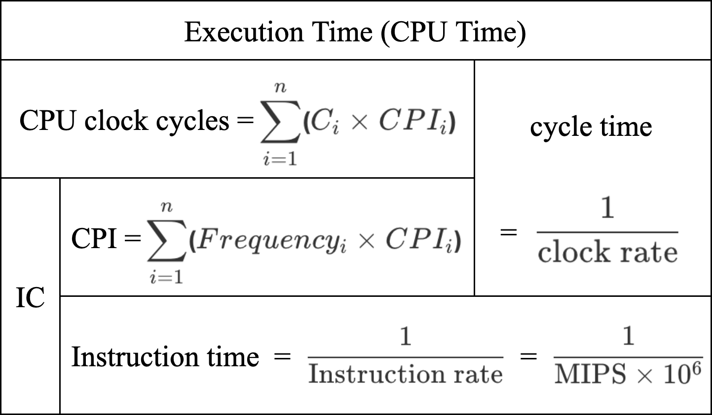

# {{ book.computer_organization.chapter3.title }}
<!-- toc -->

## 效能 (Performance) 的定義
---
- 兩種衡量計算機效能的標準:
  - **反應時間(respone time)**:
    - 工作從開始到結束所花的時間，又稱**執行時間(execution time)**
    - 適用於**比較執行相同程式的兩部不同個人電腦**
  - **生產量(throughput)**:
    - 單位時間內所完成的工作量(job 數量)
    - 適用於**評比多人連線的伺服器**
- 以**執行時間**定義 computer X 之效能: $$ Performance_X $$ = $$ \dfrac{1}{\mathit{\text{Execution Time}}_X} $$
> computer X 的速度是 computer Y 的 n 倍: $$ \dfrac{Performance_X}{Performance_Y} $$ = $$ n $$

### Execution Time 的量測
- 流逝時間(elapsed time): 執行一個程式或完成一項工作的所需時間總量
  - 程式執行及等待 I/O 時間
    - Disk 和 Memory I/O
    - Input/Output I/O
    - 作業系統的開銷(Operating System overhead)
  - 處理器執行時間(CPU execution time)
  > 程式或工作使用 CPU 的時間，又稱處理器時間(CPU time)

    - 系統處理器時間(System CPU time)
    > CPU 執行作業系統的時間，為了服務使用者程式
    - **使用者處理器時間(User CPU time)**
    > CPU 執行使用者程式的時間，即**本章所量測的執行時間(execution time)**
    > - ~~absolute: wall clock~~
    > - **relative: CPU clock**

## 影響 CPU 效能的因素
---

### 以時脈週期來量測 CPU Execution Time
- 時脈(clock): computer 協調硬體動作的**同步信號**  
- 時脈週期(clock cycle): 時脈與時脈的**時間間隔**  
> $$ ^{ex.} $$ ALU 運算時，連續的 $Hi 與 $Lo 暫存器 load 完所花的時間間隔
- **時脈週期時間($$ \text{\color{blue}{clock cycle time}} $$, clock period)**: 一個時脈週期的時間
- **時脈頻率(clock rate)** = $$ \dfrac{1}{\text{clock cycle time}} $$

| clock rate(Hz)    | clock cycle time(s)         |
|:-----------------:|:---------------------------:|
| K = $$ 10^3 $$    | m = $$ 10^{-3} $$           |
| M = $$ 10^6 $$    | $$ \mu $$ = $$ 10^{-6} $$   |
| G = $$ 10^9 $$    | n = $$ 10^{-9} $$           |
| T = $$ 10^{12} $$ | p = $$ 10^{-12} $$          |

- **時脈週期數(clock cycles)** = 程式所執行的**指令個數(Instruction Count, $$ \text{\color{red}{IC}} $$)** $$ \times $$ **平均執行每個指令所需的時脈週期數(Cycles Per Instruction, $$ \text{\color{green}{CPI}} $$)**
- 一個程式的 **CPU Time** = 程式所使用的**時脈週期數 $$ \times $$ 時脈週期時間**

$$ \rightarrow \Large{\text{CPU Execution Time}} $$ = $$ \Large{\text{\color{red}{IC}}} $$ $$ \times $$ $$ \Large{\text{\color{green}{CPI}}} $$ $$ \times $$ $$ \Large{\text{\color{blue}{clock cycle time}}} $$
- **CPU clock cycles**: $$ \text{\color{red}{IC}} \times \text{\color{green}{CPI}} $$
> programs run on the same machine.

  - 在一個程式內，執行**不同指令**所需的時脈週期數不一定相同時:  
    **CPU clock cycles = $$ \displaystyle\sum_{i=1}^n $$($$ C_i \times CPI_i $$) $$ \Rightarrow $$ $$ \text{\color{green}{CPI}} $$ = $$ \displaystyle\sum_{i=1}^n $$($$ Frequency_i \times CPI_i $$)**
    > - $$ n $$: 指令類別個數
    > - $$ C_i $$: 指令類別 $$ i $$ 所使用之指令個數
    > - $$ CPI_i $$: 指令類別 $$ i $$ 之 CPI
    > - $$ Frequency_i $$: $$ \dfrac{C_i}{\text{\color{red}{IC}}} $$ 
- **Instruction time**: $$ \text{\color{green}{CPI}} \times \text{\color{blue}{clock cycle time}} $$
> machines run the same program.

> 右下角的 $$ MIPS $$ 在**「使用 MIPS 做為效能評估標準的謬誤」**裡會詳細討論

### 軟硬體如何影響效能

|   | IC | CPI | clock rate |
|:- |:--:|:---:|:----------:|
| Algorithm (Thought) | $$ \checkmark $$ | $$ \checkmark $$ | |
| High Level Programming Language | $$ \checkmark $$ | $$ \checkmark $$ | |
| Compiler | $$ \checkmark $$ | $$ \checkmark $$ | |
| \***ISA** | $$ \checkmark $$ | $$ \checkmark $$ | $$ \checkmark $$ |
| \*Computer Organization | | $$ \checkmark $$ | $$ \checkmark $$ |
| \*VLSI Technology | | | $$ \checkmark $$ |
- \***ISA** $$ \uparrow $$: software; \***ISA** $$ \downarrow $$: hardware
- \***ISA**

| $$ \because $$ | IC | CPI | cycle time |
|:-------------- |:--:|:---:|:----------:|
| RISC | 大 | 小 | 小 |
| CISC | 小 | 大 | 大 |

- \*Computer Organization

| $$ \because $$ | IC | CPI | cycle time |
|:-------------- |:--:|:---:|:----------:|
| single   | $$ \times $$ | 小 | 大 |
| multiple | $$ \times $$ | 大 | 小 |
| pipeline | $$ \times $$ | 小 | 小 |

- \*VLSI Technology $$ \because $$ IC 製程讓零件距離 $$ \downarrow $$ $$ \Rightarrow $$ 傳輸同步信號時間 $$ \downarrow $$

## 使用 MIPS 做為效能評估標準的謬誤
---
- **$$ MIPS $$ (Million Instructions Per Second)**
> 指令的執行率，又稱 **native MIPS**

$$ MIPS $$ = $$ \dfrac{\text{Instruction rate}}{10^6} $$ = $$ \dfrac{\text{IC}}{\mathit{\text{Execution Time}} \times 10^6} $$ = $$ \dfrac{\text{clock rate}}{\text{CPI} \times 10^6} $$


此 MIPS **非 Chapter 01. 之 MIPS**(Microprocessor without Interlocked Pipe Stages)!


- 以 $$ MIPS $$ 作為 computer 效能評估標準時應注意:
  - $$ MIPS $$ 雖然表示指令的執行率，卻沒有考慮每一個指令在不同指令集裡的能力
  > $$ ^{ex.} $$ Judge by same $$ MIPS $$, **CISC > RISC**
  - 同一 computer 的不同指令群，其 $$ MIPS $$ 不一定相同
  - $$ MIPS $$ 甚至可能會與 Performance 成反比

## Amdahl's Law
---
用來計算當一部機器**改善其中一部份後的執行時間**:  

$$ \mathit{\text{Execution Time}} \bold{\text{ after}} $$ = $$ \dfrac{\bold{\text{affected }} \mathit{\text{Execution Time}}}{\bold{\text{improve rate}}} $$ + $$ \bold{\text{unaffected }} \mathit{\text{Execution Time}} $$
> - $$ \mathit{\text{Execution Time}} \bold{\text{ after}} $$: **改善後**的執行時間
> - $$ \bold{\text{affected }} \mathit{\text{Execution Time}} $$: **會受改善影響**的執行時間
> - $$ \bold{\text{improve rate}} $$: **改善倍率**
> - $$ \bold{\text{unaffected }} \mathit{\text{Execution Time}} $$: **不會受改善影響**的執行時間

### 加速 (Speedup)
機器經過某種策略的**改良後，相對於原本效能之提升程度**:  

$$ \bold{\text{speedup}} $$ = $$ \dfrac{Performance \bold{\text{ after}}}{Performance \bold{\text{ before}}} $$ = $$ \dfrac{\mathit{\text{Execution Time}} \bold{\text{ before}}}{\mathit{\text{Execution Time}} \bold{\text{ after}}} $$ = $$ \bold{\dfrac{1}{\dfrac{F}{S} + (1 - F)}} $$  
(上下同 $$ \div $$ $$ \mathit{\text{Execution Time}} \bold{\text{ before}} $$)
> - $$ \mathit{\text{Execution Time}} \bold{\text{ before}} $$: **改善前**的執行時間，即 $$ \bold{\text{affected }} \mathit{\text{Execution Time}} $$ + $$ \bold{\text{unaffected }} \mathit{\text{Execution Time}} $$
> - $$ \bold{F} $$: **原始程式花在改善部分計算的比例**，即 $$ \dfrac{\bold{\text{affected }} \mathit{\text{Execution Time}}}{\mathit{\text{Execution Time}} \bold{\text{ before}}} $$
> - $$ \bold{S} $$ = $$ \bold{\text{improve rate}} $$

### Make the Common Case Fast
$$ \because $$ **改善效率**與**該部分所佔全部時間的比例**有關  
$$ \therefore $$ 一個程式只要改善較常出現的部分，就會比去對極少出現的部分做最佳化還來得有效 

## 效能總評
---

## 效能評估程式
---