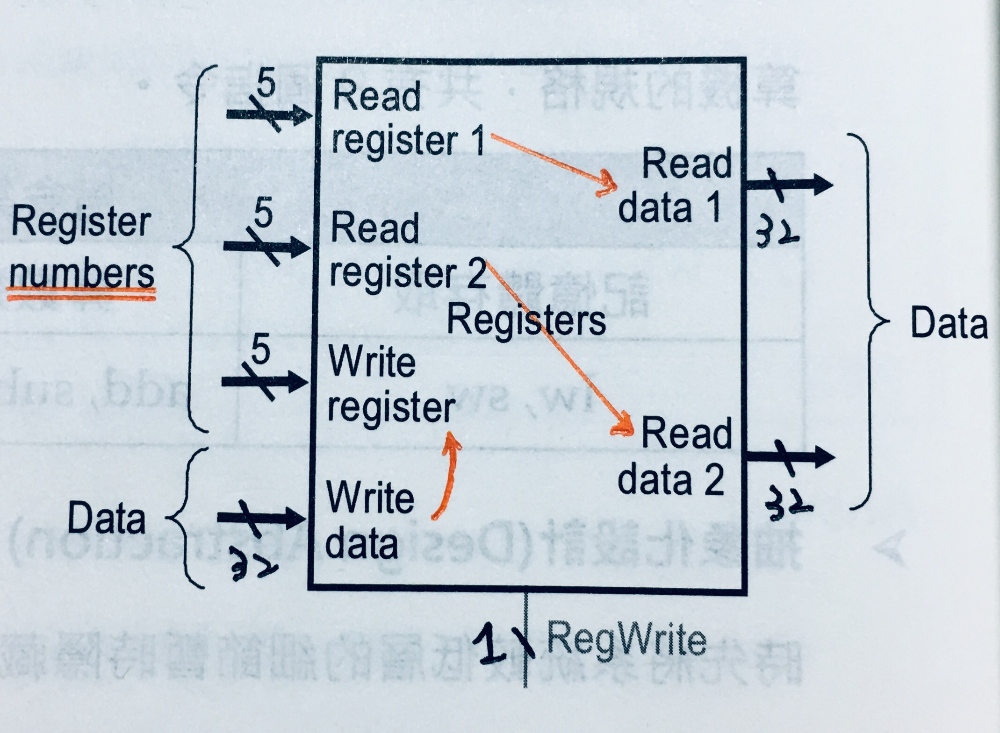
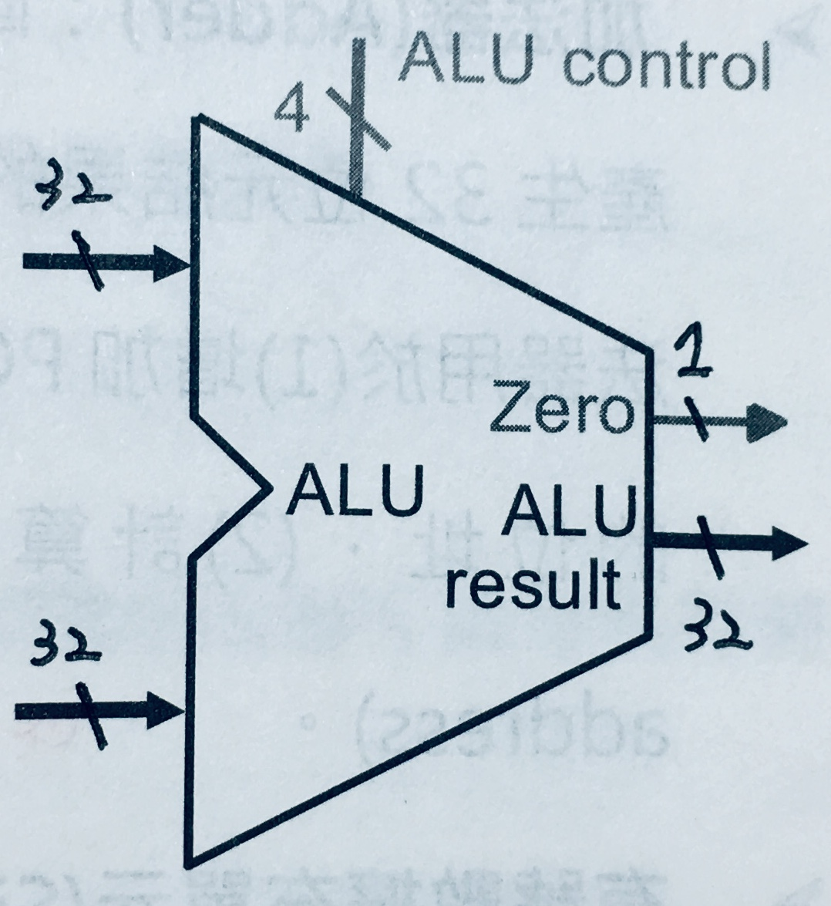
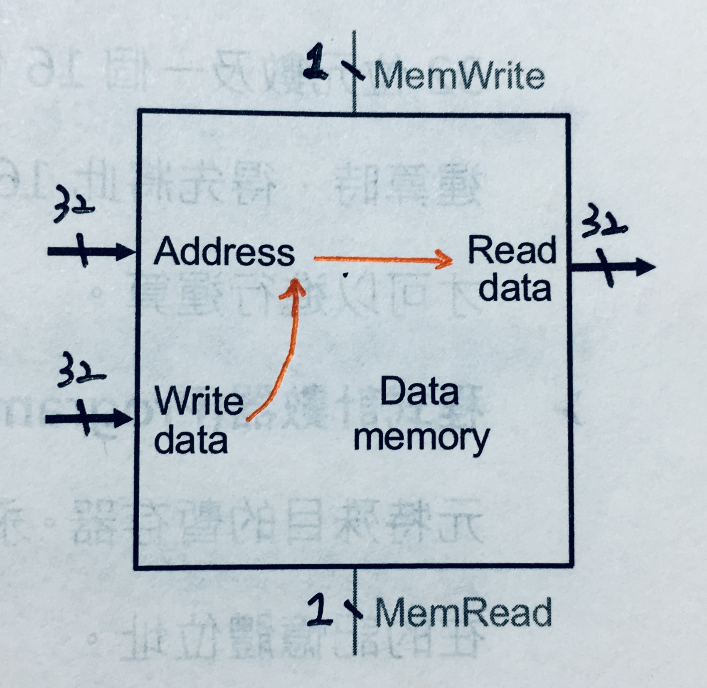
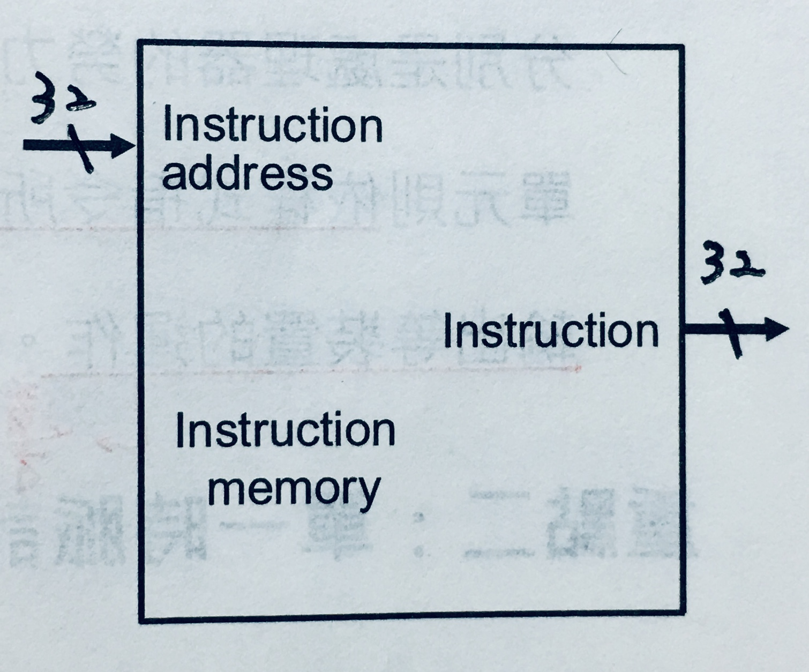
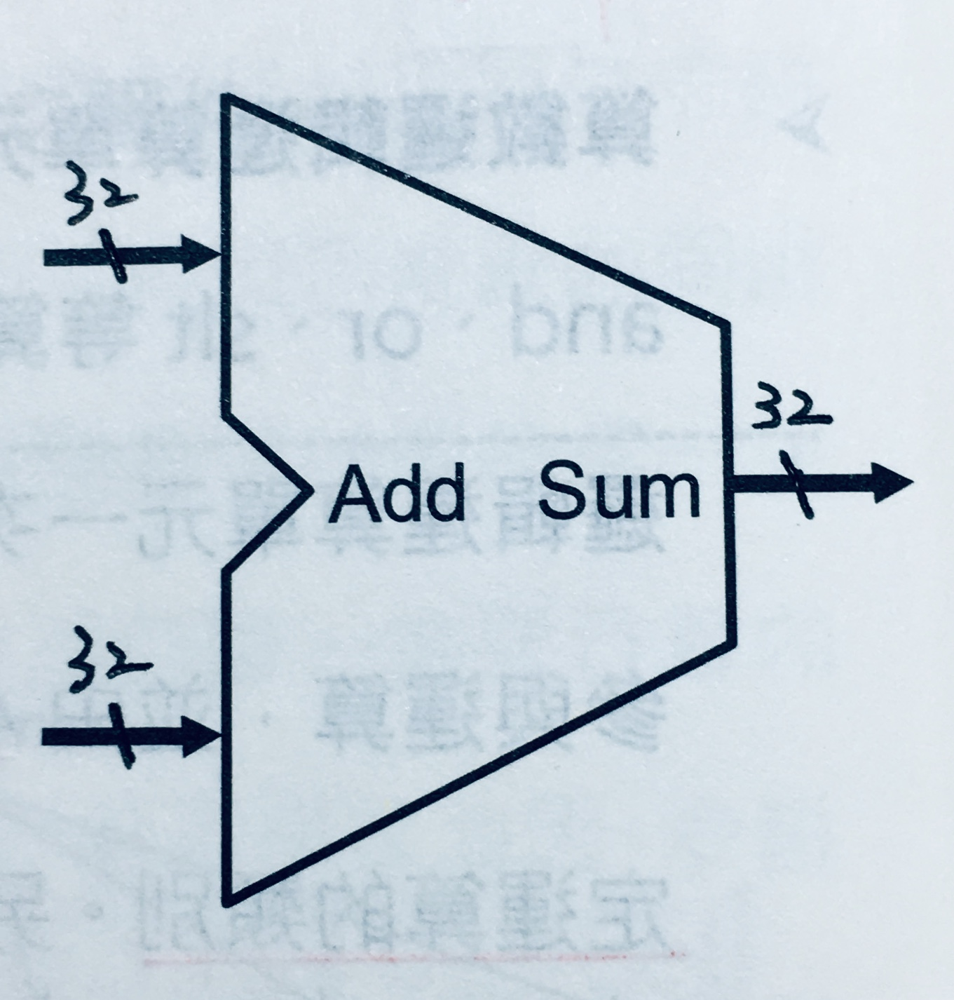
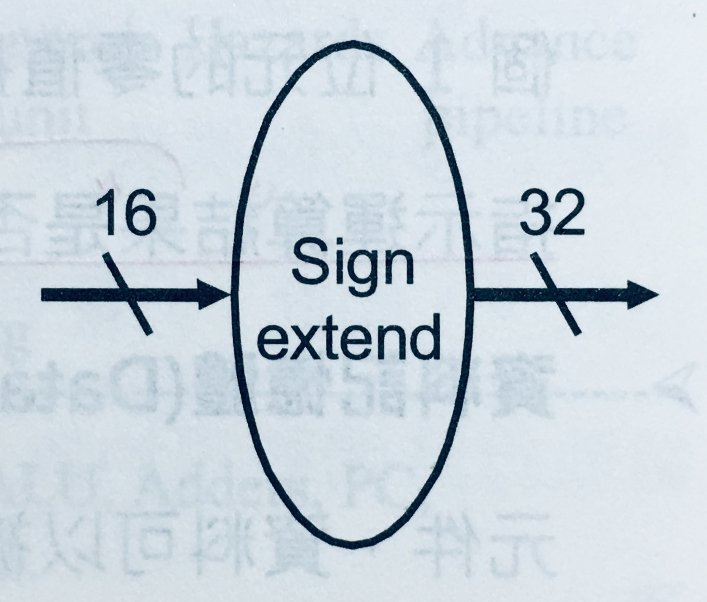
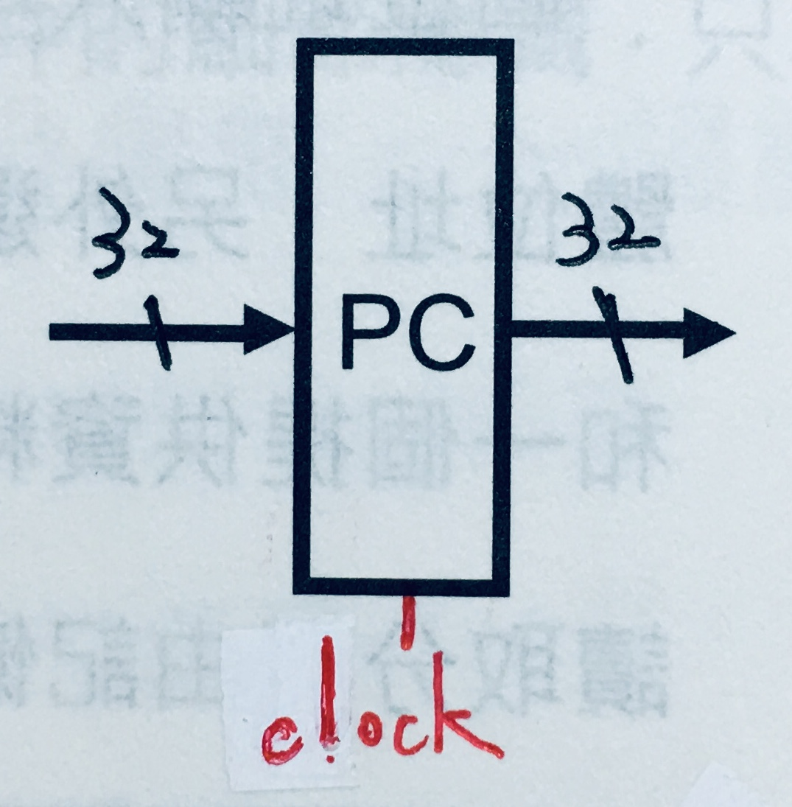
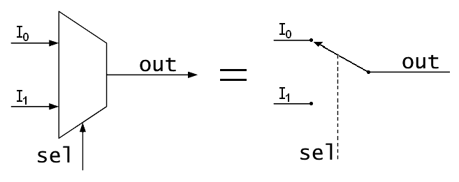
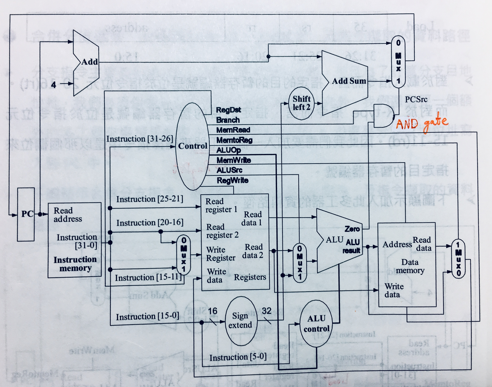
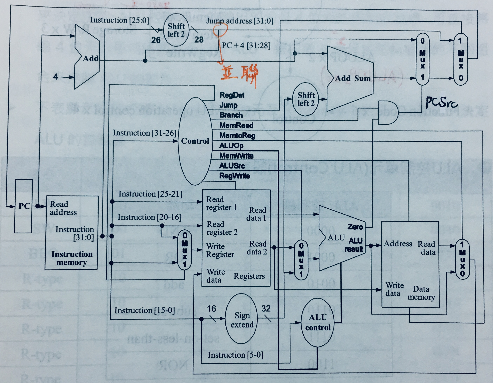

# {{ book.computer_organization.chapter4.title }}
<!-- toc -->

## 處理器 (Processor)
- 資料路徑(Datapath): **勞力部分**，執行資料存取與運算
- 控制單元(Control Unit): **腦力部分**，依指令的 **OPcode** 和 **Function Code**, 指揮 Datapath, Memory 及 I/O devices 的運作

$$ \rightarrow $$ 本章將介紹**單一時脈計算機(single cycle machine)**和**多重時脈計算機(multiple cycle machine)**，及使用以下指令集來當建構計算機之規格:

| 指令類別 | 指令集 |
|:-------:|:-----:|
| 記憶體存取 | `lw`, `sw` |
| 算術邏輯運算 | `add`, `sub`, `and`, `or`, `slt` |
| 流程控制 | `beq`, `j` |

## 抽象化設計 (Design Abstraction)
設計複雜系統時先將系統層級較低的細節暫時隱藏，以簡化設計時的複雜程度

$$ \rightarrow $$ 以下我們不關注基本零件內的建構細節，而只專注**它們之間的連接**

## 基本零件(Basic Component)

### 暫存器檔案 (Register File)
- 暫存器寫入控制信號線(RegWrite): 1 bit

### 算術邏輯運算單元 (ALU)
- ALU 控制信號線(ALU Control): 4 bits

### 資料記憶體 (Data Memory)
- 記憶體寫入控制信號線(MemWrite): 1 bit
- 記憶體讀取控制信號線(MemRead): 1 bit

### 指令記憶體 (Instruction Memory)

### 加法器 (Adder)
有別於 ALU, 用來:
- PC + 4
- 計算 branch 指令的目的位址

### 有號數擴充單元 (Sign Extension Unit)
16 bits $$ \rightarrow $$ 32 bits

### 程式計數器 (Program Counter)

### 多工器 (Multiplexor)
- 控制信號線: 1 bit
  - Jump
  - Branch $$ \rightarrow $$ AND gate $$ \rightarrow $$ PCSrc
  - RegDst
  - ALUSrc
  - MemtoReg

## 單一時脈計算機的資料路徑與控制單元圖

### 不包含跳躍指令    {#datapath_and_control_unit_without_jump}

### 包含跳躍指令    {#datapath_and_control_unit_with_jump}

