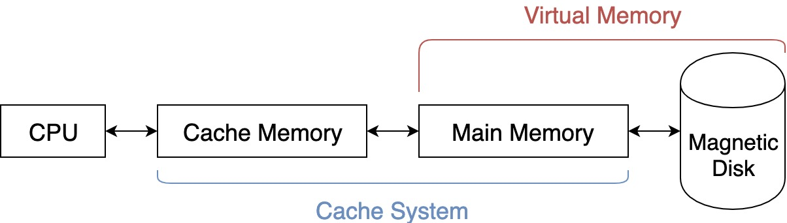
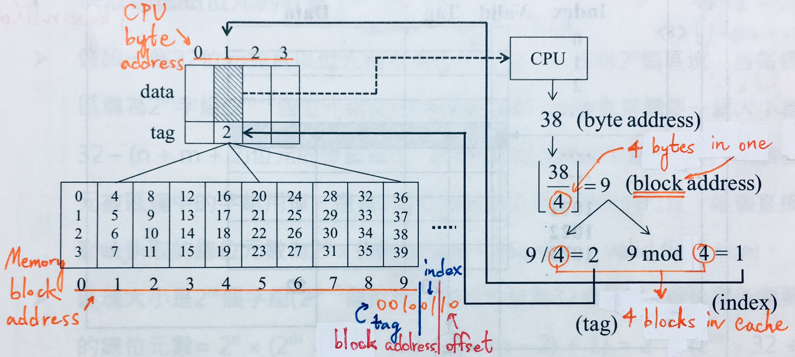
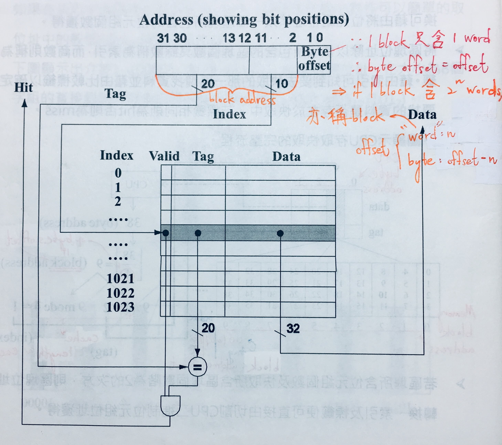
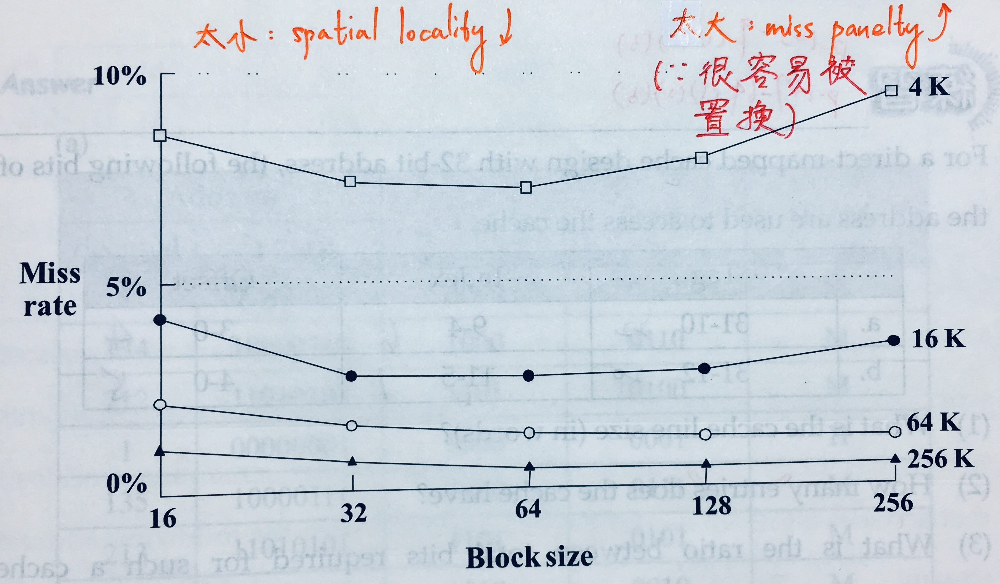
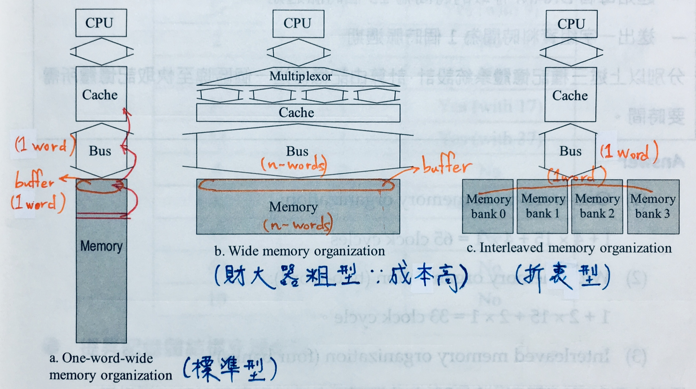

# {{ book.computer_organization.chapter6.title }}
<!-- toc -->

## 區域性原則 (Principle of Locality)   {#principle-of-locality}
程式的執行在任何一個時間點只會存取一小部分的記憶體位址空間，又稱 **locality of reference**
- **時間區域性(temporal locality)**: 如果一個指令或資料被存取到，那麼它**很快又會**被存取到
> $$ ^{ex.} $$ **迴圈**中的指令或資料
- **空間區域性(spatial locality)**: 如果一個指令或資料被存取到，那麼它**位址附近的指令或資料**也會很快被存取到
> $$ ^{ex.} $$ **循序執行的指令**或**陣列**

> $$ ^{ex.} $$ Write a C program which exhibits the *temporal* and *spatial localities*.
```c
void clearArray(int array[], int size) {
    int i;
    for (i = 0; i < size; i++) {
        array[i] = 0;   // i: temporal locality; array: spatial locality
    }
}
```

## 不同的記憶體技術
$$ \because $$ 記憶體**容量** $$ \uparrow \Rightarrow $$ 找尋存取位址的**解碼時間** $$ \uparrow \therefore $$ 記憶體**速度** $$ \downarrow $$，不過幸好有 **[locality of reference](#principle-of-locality)**，因此可使用不同的大小與速度的記憶體組成**[階層式記憶體](#memory-hierarchy)**來達到容量大且速度快之需求，以下為三種主要的技術:
- **靜態隨機存取記憶體(Static Random Access Memory, SRAM)**
- **動態隨機存取記憶體(Dynamic Random Access Memory, DRAM)**

| 一位元的儲存細胞 | SRAM | DRAM |
|:-------------:|:----:|:----:|
| 1 bit storage | 兩個**反向閘(inverter)**形成 **latch** | 以電荷儲存於**需 refresh** 之**電容器(capacitor)** |
| **體積**       | **大** | **小** |
| 速度           | 快     | 慢     |

- **磁碟(Magnetic Disk)**

## 記憶體階層 (Memory Hierarchy)    {#memory-hierarchy}
目的: 讓使用者能用**最便宜的技術**來擁有足夠的記憶體，且利用最快的記憶體來提供**最快的存取速度**

| 技術 | 距離 CPU | 速度 | 容量 | $/bit |
|:-----------:|:-------:|:-----:|:----:|:-----:|
| SRAM        | 近 | 快 | 小 | 高 |
| DRAM        | $$ \downarrow $$ | $$ \downarrow $$ | $$ \uparrow $$ | $$ \downarrow $$ |
| 磁碟         | 遠 | 慢 | 大 | 低 |


> 現行技術:
> - **Cache** Memory: **SRAM**
> - **Main** Memory: **DRAM**

### 區塊的命中與失誤    {#block-read-hit-and-miss}
- 兩記憶體層次中最小的資料傳輸單位稱為**區塊(block)**或**行(line)**
- **命中(hit)**: CPU 可以在**層次較近**的記憶體中找到需要的資料
> 比率: **命中率(hit rate/ratio)**
- **失誤(miss)**: CPU 無法在層次較近的記憶體中找到需要的資料，需要至層次較遠的記憶體裡找尋包含此資料的區塊
> 比率: **失誤率(miss rate)** = 1 - hit rate
- **命中時間(hit time)**: CPU 用在**判斷命中或失誤** + **從層次較近的記憶體存取資料**的時間
> 其中大部分時間花在**資料存取**上
- **失誤懲罰時間(miss penalty)**: CPU 從**層次較遠的記憶體抓取失誤的區塊，載入層次較近的記憶體** + CPU 存取記憶體區塊裡的資料之時間
> 其中大部分時間花在**記憶體層次間的區塊抓取與載入**上

$$ \rightarrow $$ $$ \because $$ **層次距離 CPU 較近**的記憶體**容量小**且**存取速度快** $$ \therefore $$ **命中時間 << 失誤懲罰時間**
- **命中率夠高**:
  - CPU 存取資料的速度 = 層次距離 CPU **最近**之記憶體的存取速度
  - 記憶體的儲存容量 = 層次距離 CPU **最遠**之記憶體的儲存容量

## 直接對映快取記憶體 (Direct-mapped Cache Memory)  {#direct-mapped-cache-memory}



> **Main Memory** 如果是 **word addressing**, offset = **word(block)** offset.

### 快取記憶體位元的計算
考試時給:
- **Cache size**(**不包含 tag 欄位和 valid bit**): ? bytes = (? / 4) words $$ \, \text{------} \, \spadesuit $$
- **block size**: word(s) / block $$ \, \text{------} \, \clubsuit $$
- **address length**: ?-bits

Steps:
- **求 block 總數**: $$ \dfrac{\spadesuit}{\clubsuit} \, \text{------} \, \heartsuit $$ 
- **切位址**求 tag 欄位 bit 數 $$ \text{------} \, \diamondsuit $$
- [$$ 1 $$ + $$ \diamondsuit $$ + ($$ \clubsuit $$ **in bits**)] $$ \times \heartsuit $$
> $$ 1 $$: **valid bit**

### 區塊大小與快取失誤率


**減少失誤懲罰時間**之方法(CPU 皆無需等到距離層次較近的記憶體區塊的字組全部載入完才開始讀取):
- **儘早重新開始(early start)**: CPU 直到區塊中所需要的字組送到層次較近的記憶體裡時，才讀取該字組
> $$ ^{ex.} $$ 若**[直接對映快取記憶體](#direct-mapped-cache-memory)**之**第一張圖**裡 ** 9 號 block [36, 37, 38, 39]** 為四個字組，則 CPU 讀取 **38** 號字組之順序為:  
> 載入 36 $$ \rightarrow $$ 37 $$ \rightarrow $$ 38, CPU 讀取 $$ \rightarrow $$ 39
- **需要的字組先送(requested/critcal word first)**: CPU 所需要的字組會先從層次較遠的記憶體送到層次較近的記憶體裡並讀取，剩餘的字組才依序載入
> $$ ^{ex.} $$ 若**[直接對映快取記憶體](#direct-mapped-cache-memory)**之**第一張圖**裡 ** 9 號 block [36, 37, 38, 39]** 為四個字組，則 CPU 讀取 **38** 號字組之順序為:  
> 載入 38, CPU 讀取 $$ \rightarrow $$ 36 $$ \rightarrow $$ 37 $$ \rightarrow $$ 39

$$ \therefore $$ **速度**上: **儘早重新開始 > 需要的字組先送**

## 快取的基礎概念
**讀取快取的命中與失誤**已在**[區塊的命中與失誤](#block-read-hit-and-miss)**中講解，以下為寫入命中後與失誤時快取與主記憶體如何處理與配置

### 寫入命中後快取的處理
- **寫穿(write-through)**: CPU 寫入快取的**同時也寫入主記憶體**
  - 優點: **設計簡單**
  - 缺點: **效能差**
- **寫入緩衝器(write-buffer)**: **寫穿的改良**，CPU 寫入快取的**同時也寫入緩衝器**，寫入後 CPU 可以繼續執行；當 CPU 企圖寫入已滿的緩衝器時，必須被暫停直到緩衝器寫入主記憶體後清空為止
> **緩衝器(buffer)**: 小小記憶體，可用 **SRAM**
- **寫回(write-back)**: CPU 要寫入記憶體時，**只先寫入快取**，直到在快取中被寫入的區塊要**被置換時才寫入主記憶體**
  - 優點: **效能佳**
  - 缺點: **設計複雜**

### 寫入失誤時快取的配置
- **寫入配置(write-allocate)**: 在快取中配置一區塊，由主記憶體中取得所需區塊資料後，將其寫入配置之區塊中
> 通常搭配: **寫回(write-back)**
- **寫入不配置(no-write-allocate)**: 又稱**繞過寫入(write-around)**，直接繞過快取，寫入在主記憶體中該區塊的部分，而不在快取中配置此區塊
> 通常搭配: **寫穿(write-through)**

### 快取的實現
- **分離式快取(split/seperate cache)**: 分成**指令快取**與**資料快取**，為 **[Harvard Architecture](https://zh.wikipedia.org/wiki/哈佛架構)**，現今的**商用 computer**、**pipeline Datapath**($$ \because $$ **avoid structural hazard**) 皆是
  - 優點: **頻寬較大**
  - 缺點: **命中率較低**
- **結合式快取(combined/unified cache)**
  - 優點: **命中率較高**
  - 缺點: **頻寬較小**

> **頻寬(bandwidth)**: 資料量 / 單位時間

### 設計支援快取的記憶體系統

> **交錯(interleaving)**: 位址透過匯流排送至需要存取的 1 word Memory banks 時，允許**同時存或取**所需資料

### 提升記憶體結構支援快取
- **[EDO RAM](https://zh.wikipedia.org/wiki/EDO_RAM)**(**Extended Data Output** Random Access Memory): 2 dimensions(page)
- **SDRAM**(**Synchronous** Dynamic Random Access Memory): 3 dimensions(pages)，**爆量存取(burst access)**的資料藉由**時脈訊號(clock signal)**所控制
- **DDR SDRAM**(**Double Data Rate** Synchronous Dynamic Random Access Memory): 資料在**時脈的上升與下降邊緣皆可傳輸** $$ \Rightarrow $$ **同樣的時脈速度**可獲得**雙倍頻寬**
- **QDR SDRAM**(**Quad Data Rate** Synchronous Dynamic Random Access Memory): 分開輸入與輸出，**讀寫可同時進行** $$ \Rightarrow $$ **同樣的時脈速度**可獲得**四倍頻寬**

> 考試會考**縮寫拼出全名**

### 快取效能的量測
