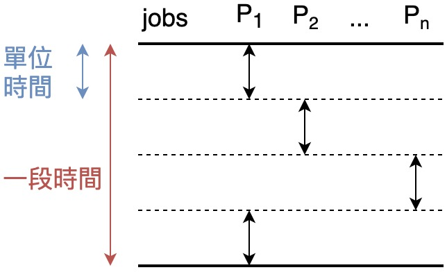
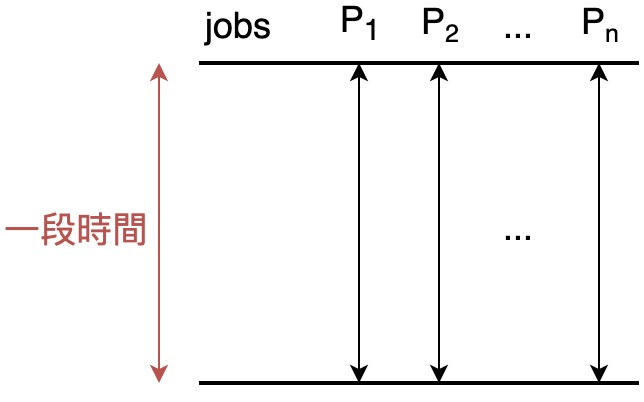
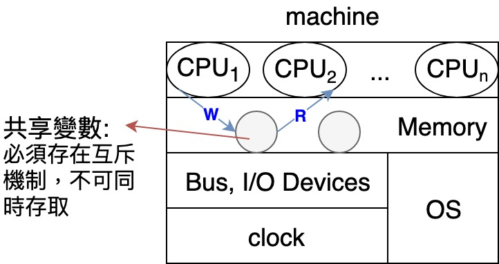
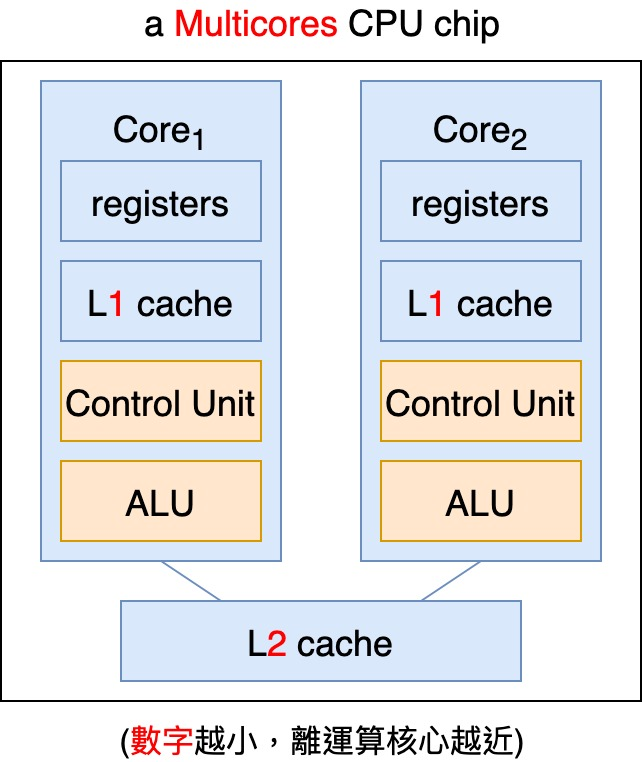
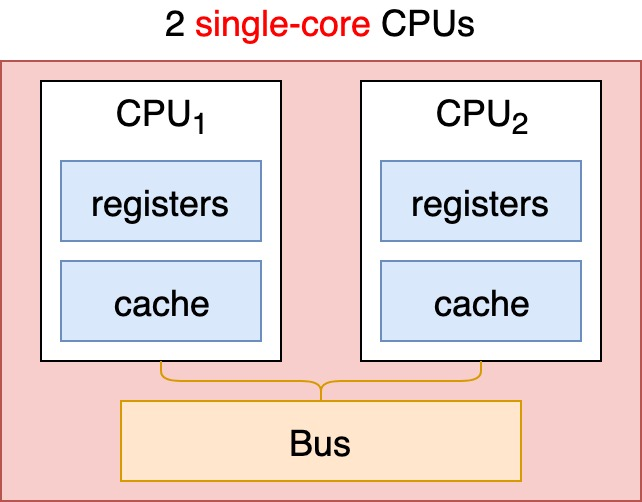

# {{ book.operating_system.chapter1.title }}
<!-- toc -->

## Computer System Structure
- Users
> $$ ^{ex.} $$ human beings, other machines or systems
- Programs
  - System Programs: 幫助 programmer 的開發 service
  > $$ ^{ex.} $$ Compiler, Assembler, Linking Loader, Debugger, ...
  - Application Programs: 一般 user 的 service
  > $$ ^{ex.} $$ Text Editor, DBMS, Office, ...
- **Operating System**
- Hardware
> $$ ^{ex.} $$ CPU, Memory, I/O Devices, ...

> - **裸機(Bare Machine)**: 純粹只有硬體組成，其上無任何 OS 及 System Programs
> - **伸延機器(Extended Machine)**: Bare Machine 上加入 OS/System Programs/Application Programs

## OS 之架構 (Structure)

## OS 之扮演角色 (Roles) 或目的
- 提供一個讓 Users 易於操作電腦之溝通介面
- 提供一個讓 Users Programs 易於執行之環境
- 作為一個資源(resource)的管理者，協調分配這些 resources($$ ^{ex.} $$ CPU, Memory, I/O, ...)，期望資源可以被有效利用，甚至公平使用
- 作為一個監督者，監控所有 Processes 執行，避免 Process 之有意或無意的破壞，造成 System 重大危害

## System Types

### 多元程式設計系統 (Multiprogramming System)
- Define: 系統允許多個 jobs(Processes) in the Memory 同時執行
  - 主要目的: **提高 CPU utilization**，避免 CPU idle
  - 作法: 透過 **Job Scheduling**(or **CPU Scheduling**) 技術達成  
    $$ ^{ex.} $$ 當執行中的 Process 在 waiting for I/O-completed 時，OS 可將 CPU 切換給另一個 Process 執行(**Context Switching**) $$ \Rightarrow $$ 只要系統內有夠多的 jobs 存在，CPU idle 的機率就會下降(CPU always busy.)
- **Multiprogramming Degree**: 存在於系統內執行的 Processes 數目  
  - 一般而言，Degree $$ \uparrow \Rightarrow $$ CPU utilization $$ \uparrow $$
  > 「**08. Virtual Memory**」之 **Thrashing** 狀況除外

- 多個 Processes 同時執行之兩種方式
  - **Concurrent(並行) Execution**: 一段時間內在**單顆 CPU(one core)** 上執行多個 Processes，但切成單位時間來看，每個單位時間內只會有一個 Process 執行

    

  - **Parallel(平行) Execution**: 一段時間內在**多顆 CPUs(multiple cores)** 上同時執行不同的 Process

    


True/False?
1.  Multiprogramming System 一定要 Multiprocessors(多顆 CPU) System 支持才行
2.  Multiprogramming System 一定要 Multiusers(多人) System 支持才行

> 1. False $$ \because $$ **Single-CPU by Concurrent Execution** 也可以
> 2. False $$ \because $$ **Single-users System** 也可以

### 分時系統 (Time-Sharing System)
- Define: 又稱**Multitasking(多工) System**, It's **a logical extension of Multiprogramming System**(**Multiprogramming System 之一種**). CPU switches jobs **more frquently than Multiprogramming System** so that users can interact with each job while it's running, creating **interactive computing**. $$ \Rightarrow $$ 適合 **Interactions with users**
> $$ ^{ex.} $$ Mainframe 大型主機 $$ \leftrightarrow $$ 終端機群, Unix

- 強調:
  - response time 要短($$ ^{ex.} $$ < 1 second.)
  - 對每個 users job 要公平對待
  - 讓每個 users 覺得有自己專屬的 computer 之感覺

- 技術:
  - **CPU Scheduling** 採用 **RR(輪迴)排班**
  > 詳見「**04. Processes**」

  - 採用 **Swapping**，即 **Virtual Memory**
  > 詳見「**08. Virtual Memory**」

  - 採用 **Spooling**，讓每個 users 有自己的 I/O Device 之感覺，同時也**一併使用 Buffering**

### 多處理器系統 (Multiprocessors System)
- Define: 又稱 Multiprocessing System, **平行系統(Parallel System)** 或 **緊密耦合系統(Tightly Coupled System)**，主要特色如下:
  - 一部機器(或**主機板**)內裝置**多顆 Processors**(或 **CPUs**)，彼此**共享**此一機器內的 Memory, Bus, I/O Devices, power-supply, ...etc.
  - 通常所有 CPUs **均受同一個 clock 之時脈控制**
  - 通常由**同一個 OS** 管控所有 CPU
  - 這些 Processors 之間的溝通大都採 **Shared Memory** 的方式
  > 詳見「**06. Process Synchronization**」

- 優點:
  - **產能增加(Increased Throughput)**: $$ \because $$ 支持 **Parallel Computing**，$$ \therefore $$ 同一時間內可有多個 jobs 在不同 CPU 上平行執行；然而，**$$ n $$ 顆 CPUs 之產能必定 $$ < $$ 一顆 CPU 產能 $$ \times $$ $$ n $$ 倍**，$$ \because $$
  
    - **資源競爭(Resource Contention)**，$$ \because $$ 共享資源
    - **Processors 之間的 communications** 會導致不見得所有 jobs 都可以被平行執行
  
    $$ \therefore $$ 效能會被抵減

  - **可靠度提昇(Increased Reliability)**: 當某顆 CPU 故障，其他 CPUs 仍可正常執行工作，系統不至於因而停頓或終止
    - **漸進式毀損(graceful degradation)**: 系統不會因為某些硬體或軟體的元件故障而停頓，仍保持續運作之能力，又可稱為**適度的降級**、**從容弱化**或**故障弱化(fail-soft)**
    - **容錯系統(fault tolerant system)**: 具有 graceful degradation 能力的系統
  - 運算能力之**規模擴充具經濟效益(Economy of Scale)**: $$ \because $$ 這些 CPUs **共享**此機器的 Memory, Bus, ...等其他資源，$$ \therefore $$ 成本 $$ \downarrow $$

#### 對稱式多處理器 (Symmetric Multiprocessors, SMP)
- Define: 每個 Processor 所負責(提供)的工作能力**皆相同(identical)**，且均有對等權利存取各式資源
- 設計重點: **Load Balancing**
> 詳見「**04. Processes**」

- 優點:
  - **Reliability 較高**
  - **Throughput 較高**
- 缺點: **OS 之設計與開發較複雜**，$$ \because $$ **Load Balancing** 須針對共享資源及 data 提供嚴謹的互斥存取機制

#### 非對稱式多處理器 (Asymmetric Multiprocessors, ASMP)
- Define: 每個 Processor 所負責(提供)的工作能力**不盡相同**，通常採 **Master-slave(主僕式，或稱 Boss-employee)架構**，即有顆 Master CPU 負責管理資源配置與分派工作給其餘 Slave CPUs
- 優點: **OS 之設計與開發較簡單**，$$ \because $$ 很容易**從 Single-CPU OS 版本修改**而得
- 缺點:
  - **Reliability 較低**: $$ \because $$ 每一個 CPU 工作能力不一定相同  
    $$ ^{ex.} $$ 若 **Master CPU 故障**，則系統會停頓直到選出新的 Master 才會恢復運作
  - **Throughput 較低**: $$ \because $$ **Master CPU** 會是**效能瓶頸**

#### 多核 CPU 晶片 (Multicores CPU Chip)
以 OS 角度來看，以下兩者**皆相同**且視為 **2 個 "logical" CPUs**

- **速度較 2 Single-core CPUs 快**，$$ \because $$ 不用透過 Bus 溝通
- **更省能源(power saving)**

### 分散式系統 (Distributed System)

### 即時系統 (Real-Time System)

### 手持系統 (Handheld System, Mobile Computing)
- Example: **mobile devices**
  - 個人數位助理(Personal Digital Assistants, PDAs)
  - smart phone: Apple iOS, Android by Google support
- 主要是因為 mobile device hardware 上天生的限制，使得在 OS 及 Application 設計時有所要求/限制，如下表所示:

| hardware 之天生限制 | software 之設計要求/限制 |
|:----------------- |:---------------------- |
| 1. **slower Processor** $$ \because $$ power-supply 有限且耗能大 + 散熱問題 | $$ \Rightarrow $$ 運算不宜過度複雜 |
| 2. **Memory size 小** | $$ \Rightarrow $$ 程式宜精簡 + 不用的 Memory space 即刻 released |
| 3. **display screen 小** | $$ \Rightarrow $$ 顯示之結果或內容疑有所剪裁 $$ ^{ex.} $$ **網頁截取(Web Clipping)**或**[響應式網頁設計(Responsive Web Design, RWD)](https://zh.wikipedia.org/wiki/響應式網頁設計)**|

### 批次系統 (Batch System)
- Define: 將一些**非急迫性**或**具週期性**的 jobs 累積成堆，再整批送入系統處理，過程中**不須與 user 互動(interaction)**
- 主要目的: 提高冷門時段之資源利用度(resources utilization)
- **不適用**於需 **user-interactive** 或 **real-time** 的 Applications.
- Example: 報稅系統、下載軟體更新、掃毒、磁碟重組、庫存盤點 ...etc.
