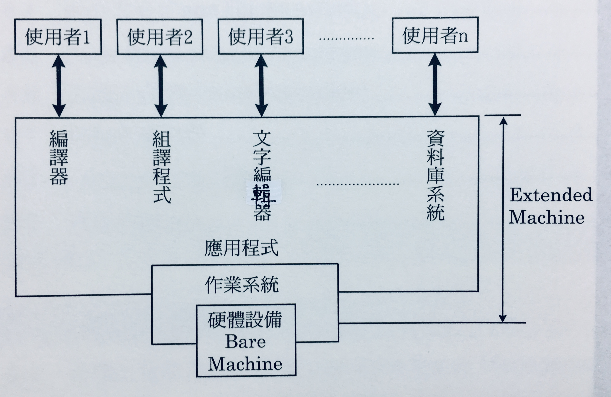

# {{ book.operating_system.chapter1.title }}
<!-- toc -->

## Computer System Structure
- Users
> $$ ^{ex.} $$ human beings, other machines or systems
- Programs
  - System Programs: 幫助 programmer 的開發 service
  > $$ ^{ex.} $$ Compiler, Assembler, Linking Loader, Debugger, ...
  - Application Programs: 一般 user 的 service
  > $$ ^{ex.} $$ Text Editor, DBMS, Office, ...
- **Operating System**
- Hardware
> $$ ^{ex.} $$ CPU, Memory, I/O Devices, ...

> - **裸機(Bare Machine)**: 純粹只有硬體組成，其上無任何 OS 及 System Programs
> - **伸延機器(Extended Machine)**: Bare Machine 上加入 OS/System Programs/Application Programs

## OS 之架構 (Structure)

## OS 之扮演角色 (Roles) 或目的
- 提供一個讓 Users 易於操作電腦之溝通介面
- 提供一個讓 Users Programs 易於執行之環境
- 作為一個資源(resource)的管理者，協調分配這些 resources($$ ^{ex.} $$ CPU, Memory, I/O, ...)，期望資源可以被有效利用，甚至公平使用
- 作為一個監督者，監控所有 Processes 執行，避免 Process 之有意或無意的破壞，造成 System 重大危害

## System Types

### 多元程式設計系統 (Multiprogramming System)

### 分時系統 (Time-Sharing System)

### 多處理器系統 (Multiprocessors/Multicores System)

### 分散式系統 (Distributed System)

### 即時系統 (Real-Time System)

### 手持系統 (Handheld System, Mobile Computing)
