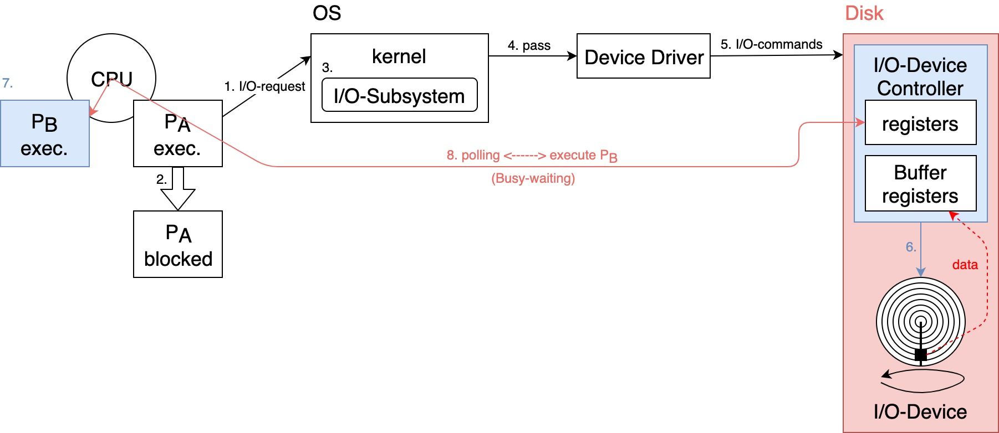
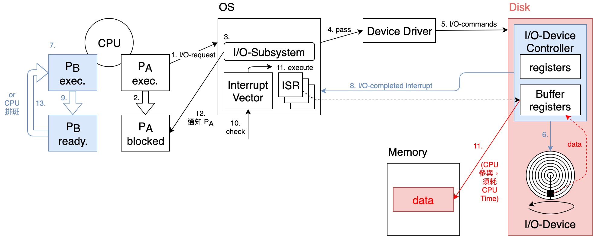

# {{ book.operating_system.chapter2.title }}
<!-- toc -->

## I/O 運作方式

### 詢問式 I/O (Polling I/O)    {#polling-io}
- Define: 又叫 **Busy-waiting I/O** 或 **Programmed I/O**，Steps 如下:
    1. 執行中的 Process 對 OS **發出 I/O-request**，希望 OS 提供某種 I/O 服務  
    > $$ ^{ex.} $$ Disk read a file.
    2. OS 收到請求後，(可能)會先**暫停(block)該 Process**，即此 Process 會**放掉 CPU**，置於 **Waiting Queue** 等待 **I/O-completed**  
    3. OS(or kernel) 中的 **I/O-Subsystem** 會處理此請求  
    > $$ ^{ex.} $$ **I/O-Subsystem** 會檢查 **Disk cache** 是否命中，詳見「**09. Disk Management**」  
    > - **命中**: 從 Disk cache 取出 file 資料，**不需執行 real I/O-operation**
    > - **失誤**: **需執行 real I/O-operation**
    4. **I/O-Subsystem** 會 *pass 此請求給**裝置驅動程式(Device Driver)***  
    > **device independent**
    5. **Device Driver** 會依此請求，設定相關 **I/O-commands** 到 **I/O-Device Controller(硬體)**  
    6. **I/O-Device Controller** 會指揮 **I/O-Device 執行 real I/O-operation**  
    7. 此時，**CPU 可能 idle**，OS 可能會將 CPU 分派給其他 Process 使用  
    8. **CPU** 會不斷地去 **polling I/O-Device Controller** 上相關 **registers** 之值，確定 **real I/O-operation completed or not, or 有無 error**  

- 缺點: **CPU** 並未將全部的時間用於執行其他 Process 上，而是**耗費大量時間於 polling I/O-Device Controller** $$ \therefore $$ **CPU utilization** $$ \downarrow $$，且 **Process Throughput** 亦 $$ \downarrow $$

### 中斷式 I/O (Interrupted I/O)
- Steps 如下:
    1. 同**[Polling I/O](#polling-io)**  
    2. 同**[Polling I/O](#polling-io)**  
    3. 同**[Polling I/O](#polling-io)**  
    4. 同**[Polling I/O](#polling-io)**  
    5. 同**[Polling I/O](#polling-io)**  
    6. 同**[Polling I/O](#polling-io)**  
    7. 同**[Polling I/O](#polling-io)**  
    8. 當 **real I/O operation 完成**時，**I/O-Device Controller** 會發出一個 **"I/O-completed Interrupt"** 通知 **OS**  
    9. OS 收到通知後，(可能)會先暫停目前執行中的 Process，保存其狀態  
    > $$ ^{ex.} P_B $$ execution $$ \rightarrow $$ ready state.
    10. **OS** 會依據 **Interrupt ID** 查詢**中斷向量(Interrupt Vector)表**，找出對應的**中斷服務處理程式(Interrupt Service Routine, ISR)**之**位址**  
    11. **跳至 ISR 位址**，**ISR 執行**  
    > $$ ^{ex.} $$ 將 file 的資料從 I/O-Device Controller 之 **Buffer registers 搬到 Memory 中**
    12. **ISR 完成**，控制權交回 kernel **I/O-Subsystem**，**通知 waiting Process** 其 I/O-completed 及結果  
    13. **OS 恢復**中斷之前的 Process 之執行，或交由 **CPU Scheduler** 決定下一個要執行之 Process  
    > $$ ^{ex.} P_B $$ ready state $$ \rightarrow $$ execution.

- 優點: **CPU** 無需花費時間於 polling I/O-Device Controller，而是**專心於 Process 之執行**上 $$ \therefore $$ **CPU utilization** $$ \uparrow $$，且 **Process Throughput** 亦 $$ \uparrow $$，系統效能因而提升
- 缺點:
  - **Interrupt 之處理**(Steps **9. ~ 12.**)仍須**耗費 CPU Time**，此段時間 **User Process 無法執行**
  > 若 **real I/O operation 之時間很短**(**< Interrupt 處理時間**)，則使用 **Polling I/O** 反而效能較好
  - 若 **Interrupt 發生頻率高**，則 **CPU utilization** $$ \downarrow $$ ($$ \because $$ CPU Time 幾乎都花在Interrupt 之處理上)
  - **CPU** 仍須**耗費時間參與 I/O-Device Controller 傳輸資料至 Memory**
  > 以上兩點將為下方的 **[Direct Memory Access (DMA)](#dma)** 鋪路

### Direct Memory Access (DMA)    {#dma}
